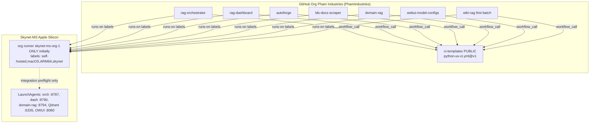

# Organization cutover (Pham Industries)

> Ops / migration guide. CI adopt → [AGENT_CI.md](AGENT_CI.md).

Status: **cutover in progress** — `ci-templates`, `rag-orchestrator`, and `rag-dashboard` are under the org; org runner online; personal runners retired.

## Migration plan


#### A.1 Target topology



#### A.2 Create the organization

1. GitHub → **New organization** → Free plan.
2. **Display name:** Pham Industries. **Login/slug:** **`PhamIndustries`** (O1 / K16 — GitHub slugs cannot contain spaces).
3. Owner: `vuudoopham`. No extra members required for v1.
4. Org settings (immediately):
   - **Actions** → allow Actions; allow reusable workflows from public repos (and later same-org).
   - **Runner groups** → Default group: allow all transferred fleet repos (include `wiki-rag`).
   - Register **one** org runner `skynet-ms-org-1` only (O2 / K11); do not provision org-2 unless queue latency requires it.
   - **Disable** repo-admin creation of *additional* repo-level self-hosted runners once org runners are stable (O8 — after Phase 5).
   - Secrets: none required for unit CI; create org secret **`WEBUI_API_KEY`** allow-listed to `webui-model-configs` (and any regress consumers) — O7 / K17 (see A.6).

#### A.3 Transfer order

GitHub repo transfers preserve Issues/PRs/Stars; Actions history may show a discontinuity; **secrets and some settings may need re-check**. Personal → org transfer requires owner confirmation in UI (or `gh api`).

| Step | Repo / action | Why this order | Post-step checklist |
|------|---------------|----------------|---------------------|
| 0 | Create **Pham Industries** (`PhamIndustries`) + org runner group + **billing go/no-go (O9)** | Prerequisite | Org runner Idle; abort if unexpected private-runner invoice risk |
| 1 | **`ci-templates`** transfer | SoT; **public**; no runner needed | Tag `v1` at `PhamIndustries/ci-infrastructure`; public clone works |
| 1b | **Pin orch/dash (+ docs) to `PhamIndustries/ci-infrastructure@v1`** while they still live under `vuudoopham/*` | K13 — avoid `uses:` blackout; public SoT is callable cross-owner | Green CI on **personal** runners within **&lt; 15 min**; freeze product pushes during pin window |
| 2 | **`rag-orchestrator`**, **`rag-dashboard`** transfer | Already on standard; validate org runner with known-green suites | Remotes; canary runner fate check (§A.4.1); confirm CI green on **org** runner |
| 3 | **`webui-model-configs`** | Has self-hosted history + secret; align labels/unit script | Bind org secret `WEBUI_API_KEY` (O7); migrate off `skynet-ms` |
| 4 | **`autoforge`**, **`lds-docs-scraper`** | Adopt standard CI (prefer before or with transfer) | LDS: self-hosted only after data-present reclassification (K14); **remove** `ubuntu-latest` |
| 5 | **`domain-rag`** + **`wiki-rag`** (**first batch**, O5) | Marker audit (domain-rag); adopt CI (wiki-rag) | Both private; enable domain-rag integration later |

**Rule:** Do not transfer a product repo until its `uses:` pin already points at `PhamIndustries/ci-infrastructure@v1` (or it does not call the reusable workflow yet). Do not transfer a repo until either (a) it already has green CI, or (b) you accept a short CI gap and adopt the standard in the same window as the transfer.

#### A.4 Migration sequence (runners)

```mermaid
sequenceDiagram
  participant You
  participant Org as GitHub Org
  participant Old as Per-repo runners
  participant New as Org runner(s)
  participant Consumers as orch/dash still under vuudoopham

  You->>Org: Create Free org Pham Industries (PhamIndustries)
  You->>New: Register one org runner skynet-ms-org-1 (Idle)
  You->>Org: Verify billing go/no-go (O9)
  You->>Org: Transfer ci-templates
  Note over You,Consumers: Freeze pushes; max pin window less than 15 min
  You->>Consumers: Merge uses: PhamIndustries/ci-infrastructure@v1 (K13)
  Consumers->>Old: Confirm green on personal runners
  You->>Org: Transfer orch (canary) then dash
  You->>Org: Check repo vs org runner fate (A.4.1)
  Consumers->>New: First CI jobs on org runner
  Note over Consumers,New: Confirm green before retiring old
  You->>Old: svc.sh stop + uninstall LaunchAgents (after 48h)
  You->>Org: Transfer remaining repos + adopt CI
  You->>Old: Delete unused runner dirs (optional)
```

#### A.4.1 Repo-scoped runner fate on transfer (must verify)

GitHub’s exact behavior for **repo-scoped** self-hosted registrations when a repo moves personal → org is easy to get wrong. Treat the following as a **canary verification**, not an assumption:

1. **Before Ops C:** org runner `skynet-ms-org-1` is **Idle** and its runner group **allows** the repo about to transfer.
2. **Transfer one canary** (prefer `rag-orchestrator` alone first).
3. Immediately check:
   - **Org → Settings → Actions → Runners** — org runner still Idle/Online.
   - **Repo → Settings → Actions → Runners** — does `skynet-ms-rag-orchestrator` still appear? Online, Offline, or gone?
4. **Record the outcome** in the cutover notes (one of):
   - **A — Repo runner survives** under the new owner: jobs with matching labels may race between repo-runner and org-runner. Prefer stopping the personal `svc` **before** or immediately after transfer so only the org runner takes jobs; do **not** wait 48h with two live runners sharing labels unless intentionally testing.
   - **B — Repo runner disconnects / vanishes:** personal LaunchAgent may still run locally but cannot accept jobs. **Org runner must already be Idle and allowed** — this is the hard dependency for Ops C. Rollback “keep personal runners idle” is **false** for GitHub job routing in this case; local binaries remain only for re-registration under the user if you transfer the repo back.
   - **C — Unexpected duplicate / offline ghost:** remove or re-register explicitly; do not proceed to dash transfer until understood.
5. Only after canary CI is green on the **intended** runner, transfer `rag-dashboard` and schedule Ops D.

**One-line rule:** If the personal runner dies on transfer, the org runner must already be Idle and allowed for that repo — otherwise CI is hard-down until fixed.

**Org runner install (sketch)** — replaces per-repo `RUNNER_MAC.md` content after cutover:

```bash
ORG=PhamIndustries   # display name: Pham Industries
DIR="$HOME/Projects/actions-runner-org-1"
mkdir -p "$DIR" && cd "$DIR"

curl -fsSL -o actions-runner-osx-arm64.tar.gz \
  https://github.com/actions/runner/releases/download/v2.336.0/actions-runner-osx-arm64-2.336.0.tar.gz
tar xzf actions-runner-osx-arm64.tar.gz

# Org registration token:
#   https://github.com/organizations/${ORG}/settings/actions/runners/new
#   or: gh api -X POST "orgs/${ORG}/actions/runners/registration-token" --jq .token

./config.sh \
  --url "https://github.com/${ORG}" \
  --token "<ORG_REGISTRATION_TOKEN>" \
  --name "skynet-ms-org-1" \
  --labels "self-hosted,macOS,ARM64,skynet" \
  --work "_work" \
  --unattended

./svc.sh install && ./svc.sh start && ./svc.sh status
```

**Retire personal runners** (after org CI is green for that repo):

```bash
cd ~/Projects/actions-runner-rag-orchestrator
./svc.sh stop; ./svc.sh uninstall
# Remove LaunchAgent if leftover:
#   ~/Library/LaunchAgents/actions.runner.vuudoopham-rag-orchestrator.*.plist
# Optionally remove runner from GitHub UI (repo Settings → Actions → Runners)
# Repeat for rag-dashboard; webui when migrated
```

Observed today:

- `~/Library/LaunchAgents/actions.runner.vuudoopham-rag-orchestrator.skynet-ms-rag-orchestrator.plist` — Started
- `~/Library/LaunchAgents/actions.runner.vuudoopham-rag-dashboard.skynet-ms-rag-dashboard.plist` — Started
- webui runner present on disk; **service not installed**

#### A.5 Remotes and `uses:` pin updates

**Local remotes** (each machine / clone):

Run `remote set-url` **per repo only after that repo’s Ops transfer** (`ci-templates` after Ops B; orch/dash after Ops C; webui after Ops E; autoforge/lds after Ops F; domain-rag **and** wiki-rag after Ops G). **Do not** bulk-retarget remotes for repos that have not moved yet — that breaks pushes during the K13 pin window (orch/dash must stay on `vuudoopham/*` until Ops C).

```bash
ORG=PhamIndustries   # display name: Pham Industries
# Example: after Ops C only — retarget transferred repos, not the whole fleet at once
for r in rag-orchestrator rag-dashboard; do
  git -C "$HOME/Projects/$r" remote set-url origin "git@github.com:${ORG}/${r}.git"
done
# Full fleet list (use only when every named repo has already transferred):
# ci-templates rag-orchestrator rag-dashboard webui-model-configs autoforge lds-docs-scraper domain-rag wiki-rag
```

**Workflow pin** (every consumer):

```yaml
# before
uses: vuudoopham/ci-templates/.github/workflows/python-uv-ci.yml@v1
# after
uses: PhamIndustries/ci-infrastructure/.github/workflows/python-uv-ci.yml@v1
```

Also update:

- `ci-templates/README.md`, `docs/REPO_CI.md`, `examples/ci.yml`, `examples/ci-standalone.yml`
- Pointers in orch/dash `Agents.md` / README (“CI: see PhamIndustries/ci-infrastructure”)
- Any hard-coded `vuudoopham/ci-templates` strings in docs

**GitHub redirects:** After transfer, `github.com/vuudoopham/<repo>` typically redirects to `github.com/PhamIndustries/<repo>` for a period. Do **not** rely on redirects for `uses:` — Actions resolves the owner string explicitly; update pins.

**Pin timing (K13):** Merge consumer `uses:` PRs in the **same cutover session as Ops B**, while orch/dash remotes still point at `vuudoopham/*`. Public `PhamIndustries/ci-infrastructure@v1` is valid from personal private repos. **Freeze pushes** to orch/dash during that window; target **&lt; 15 min** from SoT transfer to green consumer CI. Only then transfer product repos (Ops C).

#### A.6 Secrets, packages, settings

| Item | Action |
|------|--------|
| Secrets | **`WEBUI_API_KEY`** as **org secret** (O7/K17), allow-listed to `webui-model-configs` (and any regress consumers); remove stale repo copy after verify |
| Actions variables | Re-check if any |
| Packages / GHCR | None observed as fleet SoT; re-check if used later |
| Deploy keys / webhooks | Re-check NAS or external hooks if any point at old URLs |
| Branch protection | **Free org + private repos:** required status checks / branch protection rulesets for private repos generally need **Team** — see Free vs Team below |
| Default permissions | Prefer read-only `GITHUB_TOKEN` for CI |

#### A.7 Free org capabilities vs Team gaps

| Capability | Free org | Team |
|------------|----------|------|
| Unlimited public/private repos | Yes | Yes |
| Org-level self-hosted runners | Yes | Yes |
| Runner groups / repo allow-list | Yes (basic) | Yes |
| Public repo branch protection | Yes | Yes |
| **Private** repo branch protection / required checks | **Limited / paid** (historical Free gap) | Yes |
| CODEOWNERS enforcement etc. | Limited on private Free | Yes |

**Implication:** With all product repos currently **private**, Free org gives org runners but may **not** enforce “CI must pass before merge” via GitHub UI. Mitigations: (a) keep discipline / agent DoD, (b) make selected repos public, (c) upgrade to Team when enforcement matters.

#### A.8 Redirects and rollback

**Rollback decision tree** (SoT ownership matters):

```text
Problem after cutover?
├─ (a) Consumer-only (orch/dash CI red; ci-templates OK at ORG)
│     → Fix pin/workflow on consumer; or re-register personal runner if repo
│       transferred back to vuudoopham. v1 tag stays on PhamIndustries/ci-infrastructure.
│     → Personal runner local dir may still exist; GitHub routing depends on A.4.1.
├─ (b) SoT broken (PhamIndustries/ci-infrastructure missing tag / workflow unusable)
│     → Repair PhamIndustries/ci-infrastructure in place (preferred), OR transfer ci-templates
│       back to vuudoopham and re-point all uses: to vuudoopham/…@v1.
│     → Whoever owns the repo owns the v1 tag; do not leave duplicate tags
│       on both owners — delete/retag deliberately.
└─ (c) Full org abandon
      → Transfer all repos back to vuudoopham; re-register per-repo runners;
        pin uses: vuudoopham/ci-templates@v1; retire org runner.
      → v1 SoT follows ci-templates’ final owner.
```

**Operational buffers:**

1. Keep personal runner **binaries** on disk until 48h of green org CI on orch+dash — but see §A.4.1: “idle personal runner” may not still be a valid GitHub registration after transfer.
2. Do not delete `~/Projects/actions-runner-*` dirs until org runner is proven.
3. After Ops B, **`uses: vuudoopham/ci-templates@…` is invalid for Actions** (redirects do not count). Rollback of consumers requires either healthy `PhamIndustries/ci-infrastructure` or transferring SoT back (branch b).
4. Document transfer receipt (date, old URL, new URL, runner-fate A/B/C) in cutover notes.

#### A.9 Billing — verify live truth in Ops A (go/no-go)

GitHub announced a **platform fee for self-hosted runners on private repos** (order of **~$0.002 / minute**, targeted around **March 1, 2026**). This draft is dated **2026-08-19** — past that target — but public docs and changelog text have been inconsistent (some pages still describe self-hosted as free). **Do not treat billing as a vague later watch-item.**

**Ops A hard gate (O9):**

1. Open the new org’s **Billing / Actions** pages and the account billing overview.
2. Confirm whether private-repo self-hosted minutes are charged for this org **today**.
3. If charges apply (or are ambiguous with non-trivial risk): either **abort/postpone private-repo transfers** until the envelope is accepted, or proceed only after recording the expected monthly cost.
4. Public `ci-templates` remains free of private-runner minute charges for its own (nonexistent) self-hosted jobs; it does not shield private consumers.

**Expected minute envelope (order-of-magnitude, unit-only):**

| Repo | Assumed unit duration | Pushes/PRs per day (light) | Minutes / month (≈30d) |
|------|----------------------|----------------------------|-------------------------|
| rag-orchestrator | ~5–10 min | ~2–4 | ~300–1200 |
| rag-dashboard | ~3–8 min | ~2–4 | ~180–960 |
| **Orch+dash subtotal** | | | **~0.5–2.2k min/mo** |
| At $0.002/min (if charged) | | | **~$1–5 / mo** for orch+dash unit alone |
| Full fleet adoption (5–7 repos) | | | Roughly **3–5×** if similar cadence; integration jobs add more |

Keep unit jobs short; enable `run-integration` sparingly. Re-measure after first week of org CI — do not wait until the whole fleet has moved.

Also note: GitHub recommends self-hosted runners primarily for **private** repos because public fork PRs are a security risk — our fork `if:` guard remains mandatory even for private repos.

---


## Rollout Plan

### Phase 0 — Design (this document)

- **Accepted 2026-08-19.** O1–O3, O5–O7, O10–O11 resolved; O4/O8/O9 remain as documented.
- **Amendment 2026-08-19:** §D Dashboard CI status + K18–K20 + PR15–PR17 (Fleet / host strip).
- **Revision 2026-08-19:** review fixes K21–K27 (latest-run filter, `workflow_file`, badge map, PAT recipe, config path, `ok` contract, client relative time).
- **Revision 2026-08-19 (follow-up):** K21 corrected — filter SoT is **`branch=`**, not `exclude_pull_requests`; badge **`no_runs`** for empty `workflow_runs`.

### Phase 1 — Docs in `ci-templates` (pre-transfer)

- Publish org-ready docs; keep `uses: vuudoopham/...` until transfer.
- Tag remains `v1` unless inputs break.

### Phase 2 — Org + SoT transfer + consumer pin (K13)

- Create **Pham Industries** (`PhamIndustries`); **O9 billing go/no-go**; register **one** org runner; transfer `ci-templates`; freeze pushes; merge consumer `uses:` pins to `PhamIndustries/…@v1` while orch/dash still personal; prove green (&lt; 15 min).

### Phase 3 — Orch + dash repo transfer

- Canary transfer + runner-fate check (§A.4.1); remotes; prove green on org runner; then dash; **then** uninstall personal runners after buffer.

### Phase 4 — Fleet adoption PRs (can overlap Phase 3)

- webui unit alignment → autoforge → lds → **domain-rag + wiki-rag** (first batch together).
- Prefer adopt-CI **before** transfer when the repo has no CI yet (less scary).
- **Serialize** adoption merges on the single org runner (or accept queue).

### Phase 5 — Hardening

- Runner group allow-list; optional disable repo-level runners; decide Team upgrade; enable integration selectively.

### Phase 6 — Dashboard CI strip (after CI standard is useful)

- Land **PR15–PR17** once PR1 docs exist and preferably after org runner is green (Ops A+ / post–Ops C canary). May target `vuudoopham/*` pre-cutover with the same schema.
- Wire `GITHUB_CI_STATUS_TOKEN` into `com.skynet.rag-dash-shell` / `run-shell.sh`; verify badges for orch+dash first, then expand config as adoption PRs land.

### Feature flags

- `run-integration: false` is the per-repo flag.
- CI strip: omit `GITHUB_CI_STATUS_TOKEN` → “CI unavailable” (safe default); no application feature flag required.

### Rollback

- See §A.8 decision tree (consumer-only / SoT / full abandon) and §A.4.1 runner fate. Keep personal runner binaries for 48h after orch/dash org CI green; do not assume GitHub still routes to them after transfer.

---


## Risks + Mitigations

| Risk | Severity | Mitigation |
|------|----------|------------|
| Transfer breaks `uses:` mid-flight | **High** | K13: pin consumers **before** product transfers; &lt;15 min freeze; never rely on redirects |
| Personal runner dies on repo transfer | **High** | §A.4.1 canary; org runner Idle+allowed first |
| Org runner busy → long queues | **Medium** | Start with 1; serialize adoption merges; add org-2 if needed |
| Private Free org: no required checks | **Medium** | Agent DoD; optional Team later; social process |
| Self-hosted billing on private repos | **Medium** | **Ops A go/no-go (O9)** before private transfers; minute envelope in A.9; keep jobs short |
| LDS data-present tests explode on Mac | **High** | K14 + PR9 audit; unit with `data/` hidden |
| domain-rag test-plan vs fleet filters | **Medium** | PR10 mandates `integration` + update test-plan defaults |
| Forgotten live tests unmarked (`skipif` only) | **High** | Audit checklist B.8; markers required for selection |
| webui offline runner leaves regress red | **Low** | Fix via org runner; align labels |
| Local remotes forgotten after transfer | **Low** | Script in §A.5; document in cutover runbook |
| Minimum runner version enforcement | **Low** | Fleet already on **2.336.0** (&gt; 2.329.0 requirement) |
| **CI strip PAT leak** | **High** | Read-only fine-grained token (K24); LaunchAgent only; contract tests must not print secrets |
| **GitHub API rate limit** blanks the strip | **Medium** | 30–60s server cache; serve `stale: true` on 429; bounded repo list |
| **Private-repo visibility** after cutover without token | **Medium** | Document token as required for private fleet; clear “CI unavailable” UX (D.8) |
| Agents re-add CI as scrape panes | **Medium** | K18 + contract doc; CI checklist in `dashboard-ci-status.md` |

---


## See also

- [FLEET_CI_STANDARD.md](FLEET_CI_STANDARD.md)
- [RUNNER_MAC.md](RUNNER_MAC.md)
- Full design: [ORG_CUTOVER_AND_FLEET_CI_STANDARD.md](ORG_CUTOVER_AND_FLEET_CI_STANDARD.md)
