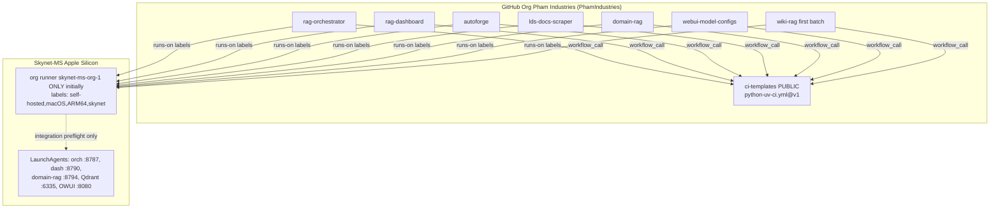
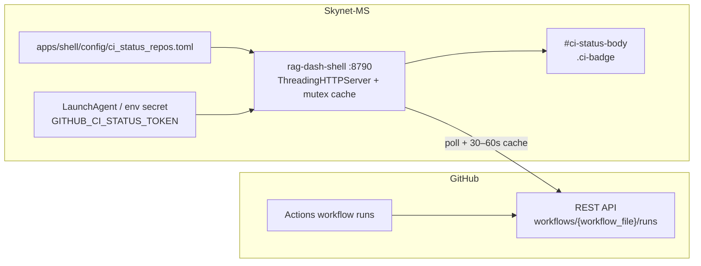

# GitHub Organization Cutover + Fleet-Wide CI/Testing Standard

| Field | Value |
|-------|-------|
| **Status** | **Accepted** (Ready for implementation) |
| **Author** | (agent) |
| **Date** | 2026-08-19 |
| **Decisions locked** | 2026-08-19 — O1–O3, O5–O7, O10–O11 resolved (see Open Questions) |
| **Amendment** | **2026-08-19** — §D Dashboard CI status (Fleet / host strip) added; K18–K20; PR15–PR17. **Revisions (same day):** K21–K27; then K21 API correction (`branch=` SoT; `exclude_pull_requests` ≠ event filter) + badge **`no_runs`** for empty `workflow_runs`. Prior org-cutover Accepted decisions unchanged. |
| **GitHub org** | Login/slug **`PhamIndustries`**; display name **Pham Industries** |
| **Audience** | Fleet maintainers + coding agents adopting CI in sibling repos |
| **Related SoT** | [`vuudoopham/ci-templates`](https://github.com/vuudoopham/ci-templates) → `PhamIndustries/ci-templates` after Ops B (`@v1`) |
| **Durable copies** | `ci-templates/docs/ORG_CUTOVER_AND_FLEET_CI_STANDARD.md`, `rag-orchestrator/docs/org-cutover-and-fleet-ci-standard.md` |
| **Later split into** | `ci-templates/docs/ORG_CUTOVER.md`, `ci-templates/docs/FLEET_CI_STANDARD.md` (or expand `REPO_CI.md` + `TEST_LAYERS.md`); dash contract `dashboard-ci-status.md` (or short § in `dashboard-provider.md`) |

---

## Overview

The Skynet Mac fleet (`rag-orchestrator`, `rag-dashboard`, `autoforge`, `lds-docs-scraper`, `webui-model-configs`, plus related `domain-rag` / `ci-templates` / **`wiki-rag`**) currently lives under the personal GitHub account `vuudoopham`. Self-hosted Actions runners are **repo-scoped**: orch and dash each have a live LaunchAgent runner (`skynet-ms-rag-orchestrator`, `skynet-ms-rag-dashboard`); `webui-model-configs` has a legacy runner (service not installed / recently offline) with historical label `skynet-ms`. As the fleet grows past ~5 repos, N personal runners become operational debt.

This design covers three tightly coupled deliverables:

1. **Organization cutover** — create Free GitHub Organization **Pham Industries** (login/slug **`PhamIndustries`**), transfer repos in a safe order, register **one** org-level self-hosted runner on Skynet-MS (Apple Silicon), retire per-repo runners, and update remotes / `uses:` pins.
2. **Fleet CI + test standard** — an agent-implementable contract so every repo places tests the same way, separates **unit** (hermetic) from **integration** (live localhost), and calls the same reusable workflow with identical script names and runner labels.
3. **Dashboard CI status (Fleet / host strip)** — compact per-repo Actions badges on the shell (`:8790`) host strip so operators see pass/fail/running without opening GitHub. **Not** mixed into scrape/index provider panes. Shell polls the GitHub Actions API (**fine-grained PAT**; see K18–K27 / §D).

`ci-templates` is already public with reusable `python-uv-ci.yml@v1` and docs (`REPO_CI.md`, `RUNNER_MAC.md`, `TEST_LAYERS.md`). Orch and dash already consume it. This document extends that model to the full fleet and replaces the personal-account runner topology with an org topology.

---

## Background & Motivation

### Current state (audited 2026-08-19)

| Repo | Visibility | Default branch | CI today | Runner | `scripts/ci-unit.sh` | Pytest `integration` marker |
|------|------------|----------------|----------|--------|----------------------|-----------------------------|
| `ci-templates` | **Public** | `main` | SoT reusable workflow `@v1` | n/a | n/a (examples only) | n/a |
| `rag-orchestrator` | Private | `master` | Thin `ci.yml` → `ci-templates@v1` | `skynet-ms-rag-orchestrator` **Started** | Yes | Declared in `pyproject.toml`; **no tests marked yet** |
| `rag-dashboard` | Private | `main` | Thin `ci.yml` → `ci-templates@v1` | `skynet-ms-rag-dashboard` **Started** | Yes (+ Node `.mjs`) | Declared; **no tests marked yet** |
| `webui-model-configs` | Private | `master` | Custom `regress.yml` (unit + live OWUI) | `skynet-ms-webui-model-configs` — **svc not installed** | No (`scripts/run-unit-tests.sh` / unittest) | N/A (unittest) |
| `lds-docs-scraper` | Private | `master` | Custom `ci.yml` on **`ubuntu-latest`** (hosted) | None | No | Not configured |
| `autoforge` | Private | `master` | **No** `.github/workflows` | None | No | Not configured |
| `domain-rag` | Private | `main` | **No** workflows | None | No | Markers planned in docs; live Qdrant uses `@pytest.mark.skipif`, not `integration` |
| `wiki-rag` (**first-batch fleet**) | Private | `main` | None | None | No | — |

LaunchAgents already on Skynet-MS for product services (`com.skynet.rag-orch`, `com.skynet.rag-dash-shell`, domain-rag/Qdrant, OWUI, providers, etc.) — relevant for **integration** preflight, not unit CI.

### Pain points

1. **N runners for N repos** — personal GitHub cannot share one registration across repos; org-level runners can.
2. **Inconsistent CI** — hosted Ubuntu (lds), custom regress (webui), missing CI (autoforge/domain-rag), vs orch/dash thin wrappers.
3. **Unclear unit vs live** — domain-rag and lds have tests that touch or skip on live data/services without a fleet-wide marker contract.
4. **Docs assume personal account** — `RUNNER_MAC.md` documents per-repo registration under `vuudoopham`.
5. **Label drift** — `skynet` (standard) vs legacy `skynet-ms` on webui.

### Why cut over now (as a planned session)

The reusable CI model already exists and works for orch/dash. Cutover unlocks **one org runner** before autoforge/lds/domain-rag/wiki-rag each need their own personal runner. Open-question decisions were locked **2026-08-19**; this document is **Accepted** and ready for implementation.

---

## Goals & Non-Goals

### Goals

1. Create a Free GitHub Organization and transfer the fleet with minimal CI downtime.
2. Register **org-level** self-hosted runner(s) with labels `self-hosted, macOS, ARM64, skynet`; retire per-repo personal runners and their LaunchAgents.
3. Update all `uses: vuudoopham/ci-templates@…` pins to `PhamIndustries/ci-templates@…` **immediately after** `ci-templates` transfers and **before** transferring product repos (K13).
4. Publish a **single agent-implementable standard** for test layout, markers, scripts, thin workflows, fork guards, and DoD.
5. Map every fleet repo to that standard (gap analysis + adoption PR order), including **`wiki-rag` in the first cutover batch**.
6. Keep unit CI **hermetic** so push/PR stays green during ops windows (index, NAS rsync, scrape).
7. Surface **latest CI status per fleet repo** on the dashboard **Fleet / host strip** (pass/fail/running + deep link to Actions) so operators need not leave `:8790` — see §D / K18–K27 (`branch={default_branch}` filter SoT).

### Non-Goals

- Upgrading to GitHub Team unless private branch protection becomes a hard requirement (O4 — when needed).
- Browser e2e / Playwright for rag-dashboard.
- Making live scrape part of default PR CI.
- Replacing product LaunchAgents or changing orch/dashboard runtime architecture (CI strip is an additive shell surface only).
- Migrating non-fleet repos (`macFoundry`, `brickfolio`, `ollama-webui`, etc.).
- Changing orch vs product ownership boundaries (scrapes stay in product repos).
- Starting with more than one org runner (second runner only if queue latency hurts — K11 / O2).
- **CI-as-product-pane:** do not invent scrape/index-style panes or Running Jobs rows for Actions under autoforge / lds / domain-rag / rag-orch providers.
- **Required GitHub status checks / branch protection UI** — separate from the dashboard strip (see Free vs Team §A.7 / O4).
- **Workflow push ingest** to the dashboard in v1 (no required `repository_dispatch` / webhook POST from Actions). Optional Phase 2 only.

---

## Key Decisions

| # | Decision | Rationale |
|---|----------|-----------|
| K1 | **Free Organization** is acceptable; upgrade to Team later only if private-repo branch protection / required checks are mandatory | Matches stated constraint; org-level runners work on Free |
| K2 | **Org-level runner(s)** replace per-repo personal runners | Avoids N registrations as fleet → 5+; one Mac can still host 1–2 runner processes |
| K3 | Transfer **`ci-templates` first** (public SoT), then pin consumers, **then** orch/dash, then webui, then autoforge/lds, then **domain-rag + wiki-rag** (first batch) | SoT must resolve at `PhamIndustries/…@v1` before product transfers; see K13; wiki-rag included (O5) |
| K4 | Keep **`ci-templates` public**; **all product repos stay private** (O3) | Cross-repo `workflow_call` needs no PAT when templates are public |
| K5 | Fleet runner labels: **`self-hosted, macOS, ARM64, skynet`** (drop `skynet-ms` after webui migrates) | Already the orch/dash + `python-uv-ci.yml` default |
| K6 | **Marker-only** unit/integration split (`@pytest.mark.integration`); optional `tests/integration/` directory is organizational sugar, **not** what CI selects on | Already in orch/dash `pyproject.toml` and `TEST_LAYERS.md`; avoids dual classification schemes |
| K7 | Required scripts: **`scripts/ci-unit.sh`**; optional `ci-integration.sh` / `ci-preflight.sh` | Established contract in `REPO_CI.md` |
| K8 | Thin `.github/workflows/ci.yml` calling reusable workflow; no copy-paste of checkout/uv logic | One place to bump Actions versions |
| K9 | **Never run fork PR code** on self-hosted (`if:` guard in reusable workflow) | Self-hosted = trusted machine with local services/secrets |
| K10 | Default **`run-integration: false`**; enable per-repo only when preflight is reliable | Unit must stay green during ops |
| K11 | Prefer **1 org runner** initially; add a second only if queue latency hurts | Simpler ops; concurrency groups already cancel in-progress per repo |
| K12 | webui: add **`scripts/ci-unit.sh` + thin `ci.yml`** (`run-integration: false`) **and** keep custom `regress.yml` on org/`skynet` labels; unittest repos are exempt from pytest marker DoD | Avoid forcing pytest conversion; dual workflows with a clear preferred shape |
| K13 | **`uses:` pin flip immediately after `ci-templates` transfer**, while orch/dash are still under `vuudoopham/*`; freeze pushes during the pin window; **max CI blackout &lt; 15 min** | Actions does not follow owner redirects for `uses:`; public `PhamIndustries/ci-templates@v1` is callable from personal repos |
| K14 | **LDS default CI moves to self-hosted Mac** (fleet labels); **remove** `ubuntu-latest` hosted job in the adoption PR — after hermetic reclassification of data-present tests (see C.5 / PR9) | One standard; hosted Ubuntu was a stopgap; Mac has production `data/` so marker audit is mandatory before the move |
| K15 | Preflight presence when `run-integration: true` is enforced by **repo DoD / PR review today**; reusable workflow currently soft-skips missing `ci-preflight.sh` — follow-up `ci-templates` change will fail closed | Document truth vs intent; avoid agents assuming workflow already enforces it |
| K16 | GitHub org login/slug **`PhamIndustries`**; display name **Pham Industries** (O1) | User decision 2026-08-19; slugs cannot contain spaces |
| K17 | **`WEBUI_API_KEY`** is an **org secret**, allow-listed to `webui-model-configs` (and any regress consumers) (O7) | Single secret SoT; least-privilege repo access |
| K18 | **CI status lives on the Fleet / host strip** — compact per-repo badges next to host health — **not** in provider panes, Scrapes/Index groups, or Running Jobs | User decision 2026-08-19; fleet already owns host/ops chrome (`GET /api/fleet` proxy); product panes stay scrape/index/flow work |
| K19 | **Shell polls GitHub Actions API** for latest workflow runs (**fine-grained PAT** v1 — K24); **no** required workflow POST / webhook ingest in v1 | User decision; keeps orch control plane free of GitHub credentials; optional push ingest = Phase 2 non-goal |
| K20 | Expose a **dedicated shell endpoint** `GET /api/ci-status` (stable JSON schema) rather than stuffing CI into orch `/api/v1/fleet` host metrics | Different auth, TTL, and failure modes from CPU/RAM probes; avoids overloading the fleet proxy; contract for agents in `dashboard-ci-status.md` (or short § in `dashboard-provider.md`) |
| K21 | **“Latest run” (v1)** = most recent run of `workflow_file` whose **`head_branch` is the repo `default_branch`**, selected via Actions query **`branch={default_branch}`** (+ `per_page` / client post-filter). Keep `push` / `workflow_dispatch` / `schedule` / similar. Optional `pr_status` is **not** v1. **`exclude_pull_requests` is not an event filter** — see §D.4 | Ops strip must not flip red on a failing PR head while `master`/`main` is green (O11); `branch=` is the real SoT |
| K22 | Configures workflows by **filename** only (`workflow_file`, e.g. `ci.yml`); Actions API `workflow_id` = that filename (GitHub accepts `ci.yml`). **No** display-`name:` lookup in v1 | Avoids 404s from treating `CI` as `workflow_id` |
| K23 | **Exhaustive** GitHub `status`×`conclusion` → UI `badge` map in §D.6, plus ordered pre-rules (`missing_workflow`, **`no_runs`** for HTTP 200 + empty `workflow_runs`); frozen in PR15 fixtures/tests | Deterministic contract for agents + UI |
| K24 | Prefer **fine-grained PAT** on org `PhamIndustries` (Contents: Read + Actions: Read + Metadata); classic PAT only as documented fallback. Pre-org: same scopes on `vuudoopham` for listed repos | Clarifies classic vs fine-grained permission names (O10) |
| K25 | Repo allow-list SoT: **`apps/shell/config/ci_status_repos.toml`** (optional `GITHUB_CI_STATUS_REPOS_JSON` override) | One discovery path for PR16; not mixed into `dashboard-providers.toml` |
| K26 | Top-level **`ok` / `unavailable_reason` / `stale`** contract per §D.6 — no dual “either/or” shapes | Stable UI + tests |
| K27 | Relative time is **client-computed** from ISO `updated_at` (and optional `run_started_at`); **omit** server `display_age` from the stable schema | Avoids frozen “5m ago” under 30–60s cache + ~4s client poll |

---

## Proposed Design

### A. Organization cutover / migration plan

#### A.1 Target topology



#### A.2 Create the organization

1. GitHub → **New organization** → Free plan.
2. **Display name:** Pham Industries. **Login/slug:** **`PhamIndustries`** (O1 / K16 — GitHub slugs cannot contain spaces).
3. Owner: `vuudoopham`. No extra members required for v1.
4. Org settings (immediately):
   - **Actions** → allow Actions; allow reusable workflows from public repos (and later same-org).
   - **Runner groups** → Default group: allow all transferred fleet repos (include `wiki-rag`).
   - Register **one** org runner `skynet-ms-org-1` only (O2 / K11); do not provision org-2 unless queue latency requires it.
   - **Disable** repo-admin creation of *additional* repo-level self-hosted runners once org runners are stable (O8 — after Phase 5).
   - Secrets: none required for unit CI; create org secret **`WEBUI_API_KEY`** allow-listed to `webui-model-configs` (and any regress consumers) — O7 / K17 (see A.6).

#### A.3 Transfer order

GitHub repo transfers preserve Issues/PRs/Stars; Actions history may show a discontinuity; **secrets and some settings may need re-check**. Personal → org transfer requires owner confirmation in UI (or `gh api`).

| Step | Repo / action | Why this order | Post-step checklist |
|------|---------------|----------------|---------------------|
| 0 | Create **Pham Industries** (`PhamIndustries`) + org runner group + **billing go/no-go (O9)** | Prerequisite | Org runner Idle; abort if unexpected private-runner invoice risk |
| 1 | **`ci-templates`** transfer | SoT; **public**; no runner needed | Tag `v1` at `PhamIndustries/ci-templates`; public clone works |
| 1b | **Pin orch/dash (+ docs) to `PhamIndustries/ci-templates@v1`** while they still live under `vuudoopham/*` | K13 — avoid `uses:` blackout; public SoT is callable cross-owner | Green CI on **personal** runners within **&lt; 15 min**; freeze product pushes during pin window |
| 2 | **`rag-orchestrator`**, **`rag-dashboard`** transfer | Already on standard; validate org runner with known-green suites | Remotes; canary runner fate check (§A.4.1); confirm CI green on **org** runner |
| 3 | **`webui-model-configs`** | Has self-hosted history + secret; align labels/unit script | Bind org secret `WEBUI_API_KEY` (O7); migrate off `skynet-ms` |
| 4 | **`autoforge`**, **`lds-docs-scraper`** | Adopt standard CI (prefer before or with transfer) | LDS: self-hosted only after data-present reclassification (K14); **remove** `ubuntu-latest` |
| 5 | **`domain-rag`** + **`wiki-rag`** (**first batch**, O5) | Marker audit (domain-rag); adopt CI (wiki-rag) | Both private; enable domain-rag integration later |

**Rule:** Do not transfer a product repo until its `uses:` pin already points at `PhamIndustries/ci-templates@v1` (or it does not call the reusable workflow yet). Do not transfer a repo until either (a) it already has green CI, or (b) you accept a short CI gap and adopt the standard in the same window as the transfer.

#### A.4 Migration sequence (runners)

```mermaid
sequenceDiagram
  participant You
  participant Org as GitHub Org
  participant Old as Per-repo runners
  participant New as Org runner(s)
  participant Consumers as orch/dash still under vuudoopham

  You->>Org: Create Free org Pham Industries (PhamIndustries)
  You->>New: Register one org runner skynet-ms-org-1 (Idle)
  You->>Org: Verify billing go/no-go (O9)
  You->>Org: Transfer ci-templates
  Note over You,Consumers: Freeze pushes; max pin window less than 15 min
  You->>Consumers: Merge uses: PhamIndustries/ci-templates@v1 (K13)
  Consumers->>Old: Confirm green on personal runners
  You->>Org: Transfer orch (canary) then dash
  You->>Org: Check repo vs org runner fate (A.4.1)
  Consumers->>New: First CI jobs on org runner
  Note over Consumers,New: Confirm green before retiring old
  You->>Old: svc.sh stop + uninstall LaunchAgents (after 48h)
  You->>Org: Transfer remaining repos + adopt CI
  You->>Old: Delete unused runner dirs (optional)
```

#### A.4.1 Repo-scoped runner fate on transfer (must verify)

GitHub’s exact behavior for **repo-scoped** self-hosted registrations when a repo moves personal → org is easy to get wrong. Treat the following as a **canary verification**, not an assumption:

1. **Before Ops C:** org runner `skynet-ms-org-1` is **Idle** and its runner group **allows** the repo about to transfer.
2. **Transfer one canary** (prefer `rag-orchestrator` alone first).
3. Immediately check:
   - **Org → Settings → Actions → Runners** — org runner still Idle/Online.
   - **Repo → Settings → Actions → Runners** — does `skynet-ms-rag-orchestrator` still appear? Online, Offline, or gone?
4. **Record the outcome** in the cutover notes (one of):
   - **A — Repo runner survives** under the new owner: jobs with matching labels may race between repo-runner and org-runner. Prefer stopping the personal `svc` **before** or immediately after transfer so only the org runner takes jobs; do **not** wait 48h with two live runners sharing labels unless intentionally testing.
   - **B — Repo runner disconnects / vanishes:** personal LaunchAgent may still run locally but cannot accept jobs. **Org runner must already be Idle and allowed** — this is the hard dependency for Ops C. Rollback “keep personal runners idle” is **false** for GitHub job routing in this case; local binaries remain only for re-registration under the user if you transfer the repo back.
   - **C — Unexpected duplicate / offline ghost:** remove or re-register explicitly; do not proceed to dash transfer until understood.
5. Only after canary CI is green on the **intended** runner, transfer `rag-dashboard` and schedule Ops D.

**One-line rule:** If the personal runner dies on transfer, the org runner must already be Idle and allowed for that repo — otherwise CI is hard-down until fixed.

**Org runner install (sketch)** — replaces per-repo `RUNNER_MAC.md` content after cutover:

```bash
ORG=PhamIndustries   # display name: Pham Industries
DIR="$HOME/Projects/actions-runner-org-1"
mkdir -p "$DIR" && cd "$DIR"

curl -fsSL -o actions-runner-osx-arm64.tar.gz \
  https://github.com/actions/runner/releases/download/v2.336.0/actions-runner-osx-arm64-2.336.0.tar.gz
tar xzf actions-runner-osx-arm64.tar.gz

# Org registration token:
#   https://github.com/organizations/${ORG}/settings/actions/runners/new
#   or: gh api -X POST "orgs/${ORG}/actions/runners/registration-token" --jq .token

./config.sh \
  --url "https://github.com/${ORG}" \
  --token "<ORG_REGISTRATION_TOKEN>" \
  --name "skynet-ms-org-1" \
  --labels "self-hosted,macOS,ARM64,skynet" \
  --work "_work" \
  --unattended

./svc.sh install && ./svc.sh start && ./svc.sh status
```

**Retire personal runners** (after org CI is green for that repo):

```bash
cd ~/Projects/actions-runner-rag-orchestrator
./svc.sh stop; ./svc.sh uninstall
# Remove LaunchAgent if leftover:
#   ~/Library/LaunchAgents/actions.runner.vuudoopham-rag-orchestrator.*.plist
# Optionally remove runner from GitHub UI (repo Settings → Actions → Runners)
# Repeat for rag-dashboard; webui when migrated
```

Observed today:

- `~/Library/LaunchAgents/actions.runner.vuudoopham-rag-orchestrator.skynet-ms-rag-orchestrator.plist` — Started
- `~/Library/LaunchAgents/actions.runner.vuudoopham-rag-dashboard.skynet-ms-rag-dashboard.plist` — Started
- webui runner present on disk; **service not installed**

#### A.5 Remotes and `uses:` pin updates

**Local remotes** (each machine / clone):

Run `remote set-url` **per repo only after that repo’s Ops transfer** (`ci-templates` after Ops B; orch/dash after Ops C; webui after Ops E; autoforge/lds after Ops F; domain-rag **and** wiki-rag after Ops G). **Do not** bulk-retarget remotes for repos that have not moved yet — that breaks pushes during the K13 pin window (orch/dash must stay on `vuudoopham/*` until Ops C).

```bash
ORG=PhamIndustries   # display name: Pham Industries
# Example: after Ops C only — retarget transferred repos, not the whole fleet at once
for r in rag-orchestrator rag-dashboard; do
  git -C "$HOME/Projects/$r" remote set-url origin "git@github.com:${ORG}/${r}.git"
done
# Full fleet list (use only when every named repo has already transferred):
# ci-templates rag-orchestrator rag-dashboard webui-model-configs autoforge lds-docs-scraper domain-rag wiki-rag
```

**Workflow pin** (every consumer):

```yaml
# before
uses: vuudoopham/ci-templates/.github/workflows/python-uv-ci.yml@v1
# after
uses: PhamIndustries/ci-templates/.github/workflows/python-uv-ci.yml@v1
```

Also update:

- `ci-templates/README.md`, `docs/REPO_CI.md`, `examples/ci.yml`, `examples/ci-standalone.yml`
- Pointers in orch/dash `Agents.md` / README (“CI: see PhamIndustries/ci-templates”)
- Any hard-coded `vuudoopham/ci-templates` strings in docs

**GitHub redirects:** After transfer, `github.com/vuudoopham/<repo>` typically redirects to `github.com/PhamIndustries/<repo>` for a period. Do **not** rely on redirects for `uses:` — Actions resolves the owner string explicitly; update pins.

**Pin timing (K13):** Merge consumer `uses:` PRs in the **same cutover session as Ops B**, while orch/dash remotes still point at `vuudoopham/*`. Public `PhamIndustries/ci-templates@v1` is valid from personal private repos. **Freeze pushes** to orch/dash during that window; target **&lt; 15 min** from SoT transfer to green consumer CI. Only then transfer product repos (Ops C).

#### A.6 Secrets, packages, settings

| Item | Action |
|------|--------|
| Secrets | **`WEBUI_API_KEY`** as **org secret** (O7/K17), allow-listed to `webui-model-configs` (and any regress consumers); remove stale repo copy after verify |
| Actions variables | Re-check if any |
| Packages / GHCR | None observed as fleet SoT; re-check if used later |
| Deploy keys / webhooks | Re-check NAS or external hooks if any point at old URLs |
| Branch protection | **Free org + private repos:** required status checks / branch protection rulesets for private repos generally need **Team** — see Free vs Team below |
| Default permissions | Prefer read-only `GITHUB_TOKEN` for CI |

#### A.7 Free org capabilities vs Team gaps

| Capability | Free org | Team |
|------------|----------|------|
| Unlimited public/private repos | Yes | Yes |
| Org-level self-hosted runners | Yes | Yes |
| Runner groups / repo allow-list | Yes (basic) | Yes |
| Public repo branch protection | Yes | Yes |
| **Private** repo branch protection / required checks | **Limited / paid** (historical Free gap) | Yes |
| CODEOWNERS enforcement etc. | Limited on private Free | Yes |

**Implication:** With all product repos currently **private**, Free org gives org runners but may **not** enforce “CI must pass before merge” via GitHub UI. Mitigations: (a) keep discipline / agent DoD, (b) make selected repos public, (c) upgrade to Team when enforcement matters.

#### A.8 Redirects and rollback

**Rollback decision tree** (SoT ownership matters):

```text
Problem after cutover?
├─ (a) Consumer-only (orch/dash CI red; ci-templates OK at ORG)
│     → Fix pin/workflow on consumer; or re-register personal runner if repo
│       transferred back to vuudoopham. v1 tag stays on PhamIndustries/ci-templates.
│     → Personal runner local dir may still exist; GitHub routing depends on A.4.1.
├─ (b) SoT broken (PhamIndustries/ci-templates missing tag / workflow unusable)
│     → Repair PhamIndustries/ci-templates in place (preferred), OR transfer ci-templates
│       back to vuudoopham and re-point all uses: to vuudoopham/…@v1.
│     → Whoever owns the repo owns the v1 tag; do not leave duplicate tags
│       on both owners — delete/retag deliberately.
└─ (c) Full org abandon
      → Transfer all repos back to vuudoopham; re-register per-repo runners;
        pin uses: vuudoopham/ci-templates@v1; retire org runner.
      → v1 SoT follows ci-templates’ final owner.
```

**Operational buffers:**

1. Keep personal runner **binaries** on disk until 48h of green org CI on orch+dash — but see §A.4.1: “idle personal runner” may not still be a valid GitHub registration after transfer.
2. Do not delete `~/Projects/actions-runner-*` dirs until org runner is proven.
3. After Ops B, **`uses: vuudoopham/ci-templates@…` is invalid for Actions** (redirects do not count). Rollback of consumers requires either healthy `PhamIndustries/ci-templates` or transferring SoT back (branch b).
4. Document transfer receipt (date, old URL, new URL, runner-fate A/B/C) in cutover notes.

#### A.9 Billing — verify live truth in Ops A (go/no-go)

GitHub announced a **platform fee for self-hosted runners on private repos** (order of **~$0.002 / minute**, targeted around **March 1, 2026**). This draft is dated **2026-08-19** — past that target — but public docs and changelog text have been inconsistent (some pages still describe self-hosted as free). **Do not treat billing as a vague later watch-item.**

**Ops A hard gate (O9):**

1. Open the new org’s **Billing / Actions** pages and the account billing overview.
2. Confirm whether private-repo self-hosted minutes are charged for this org **today**.
3. If charges apply (or are ambiguous with non-trivial risk): either **abort/postpone private-repo transfers** until the envelope is accepted, or proceed only after recording the expected monthly cost.
4. Public `ci-templates` remains free of private-runner minute charges for its own (nonexistent) self-hosted jobs; it does not shield private consumers.

**Expected minute envelope (order-of-magnitude, unit-only):**

| Repo | Assumed unit duration | Pushes/PRs per day (light) | Minutes / month (≈30d) |
|------|----------------------|----------------------------|-------------------------|
| rag-orchestrator | ~5–10 min | ~2–4 | ~300–1200 |
| rag-dashboard | ~3–8 min | ~2–4 | ~180–960 |
| **Orch+dash subtotal** | | | **~0.5–2.2k min/mo** |
| At $0.002/min (if charged) | | | **~$1–5 / mo** for orch+dash unit alone |
| Full fleet adoption (5–7 repos) | | | Roughly **3–5×** if similar cadence; integration jobs add more |

Keep unit jobs short; enable `run-integration` sparingly. Re-measure after first week of org CI — do not wait until the whole fleet has moved.

Also note: GitHub recommends self-hosted runners primarily for **private** repos because public fork PRs are a security risk — our fork `if:` guard remains mandatory even for private repos.

---

### B. Fleet CI standard (Agent Implementation Guide)

> **Copy/paste target later:** `ci-templates/docs/FLEET_CI_STANDARD.md`  
> Agents implementing a single repo should follow this section **without** tribal knowledge.

#### B.1 Directory layout

**Default (single Python package):**

```text
repo/
  tests/
    test_*.py              # unit by default
    conftest.py            # optional
    fixtures/              # optional offline fixtures
  scripts/
    ci-unit.sh             # REQUIRED
    ci-integration.sh      # optional
    ci-preflight.sh        # optional
  .github/workflows/
    ci.yml                 # thin wrapper
  pyproject.toml           # pytest markers
```

**Monorepo exception — `rag-dashboard`:**

```text
packages/contract/tests/test_*.py
apps/shell/tests/test_*.py
apps/shell/tests/test_*.mjs    # Node pure helpers
```

`pyproject.toml` already sets:

```toml
[tool.pytest.ini_options]
testpaths = ["packages/contract/tests", "apps/shell/tests"]
```

**Do not** invent a third layout. If a repo is a monorepo, declare `testpaths` explicitly and keep `ci-unit.sh` as the single entrypoint.

#### B.2 Unit vs integration definition

| Layer | Definition | May touch | Must not touch |
|-------|------------|-----------|----------------|
| **Unit** | Hermetic, offline, deterministic | tmp dirs, fixtures, mocks, in-process fakes | OWUI `:8080`, Qdrant `:6335`, orch `:8787`, domain-rag `:8794`, live scrape, NAS, real network product APIs |
| **Integration** | Needs healthy localhost services on the runner host | Explicit ports above, after preflight | Untrusted external prod SaaS; long scrapes on every PR |

Latency targets (guidance):

- Unit job: **&lt; 10 min** typical; timeout default **25–30 min** in workflow.
- Integration job: **&lt; 20 min** when enabled; fail fast on preflight.

#### B.3 Pytest marker contract

In every pytest-based repo `pyproject.toml`:

```toml
[tool.pytest.ini_options]
markers = [
  "integration: needs live localhost services",
]
```

Mark live tests:

```python
import pytest

pytestmark = pytest.mark.integration  # whole module

@pytest.mark.integration
def test_control_health_live():
    ...
```

Commands:

```bash
# unit (CI default)
uv run python -m pytest -q -m "not integration"

# integration (optional CI / local)
uv run python -m pytest -q -m integration
```

**Recommended approach: marker-only** (not directory-only).

| Approach | Pros | Cons | Verdict |
|----------|------|------|---------|
| Marker-only | One selector; matches existing orch/dash + reusable workflow | Easy to forget a mark | **Recommended** |
| `tests/integration/` only | Obvious location | CI must path-filter; mixed files awkward; dual SoT | Reject as sole mechanism |
| Both | Nice for humans | Must still mark; dirs alone insufficient | Optional co-location OK |

**Justification:** CI already filters with `-m "not integration"`. Directory co-location (`tests/integration/test_foo.py`) is allowed for clarity but **every** live test must still carry the marker (module-level `pytestmark` preferred).

**domain-rag mandate (fleet wins over local test-plan defaults):**

- `docs/test-plan-generation-delta-index-v1.md` historically suggested marks `unit` / `integration` / `live` / `slow` and default CI `pytest -m "not live and not slow"`. **Fleet gate is `not integration` only.**
- In the adoption PR (PR10): declare `integration` in `pyproject.toml`; add `@pytest.mark.integration` to **every** Qdrant live test (`test_qdrant_clone.py`, `test_delta_index_seed.py`, `test_delta_index_deletes.py`, `test_delta_index_retention.py`, and any similar). Keep `_qdrant_ready()` / `skipif` if desired for local DX, but markers are mandatory for selection.
- Update that test-plan doc’s suggested defaults to `pytest -m "not integration"` as the CI gate; treat `live` / `slow` as **optional extras** only (never the sole filter in `ci-unit.sh`).
- Filename patterns (`test_integration_*`) or directory co-location are **not** enough — unmarked live tests still run under `-m "not integration"` (and may skip via `skipif`, which is green but not selectable as an intentional integration job later).

#### B.4 Required / optional scripts

**`scripts/ci-unit.sh` (required)** — pytest repos:

```bash
#!/usr/bin/env bash
# Hermetic unit tests for GitHub Actions (self-hosted). No live services.
set -euo pipefail
ROOT="$(cd "$(dirname "$0")/.." && pwd)"
cd "$ROOT"

# Prefer matching the repo's existing uv style:
#   uv sync --extra dev   # orch, autoforge, lds
#   uv sync --group dev   # dash, some uv workspaces
uv sync --extra dev
uv run python -m pytest -q -m "not integration"
```

**`scripts/ci-unit.sh` for unittest-only repos (webui-model-configs)** — do **not** convert to pytest just to adopt the fleet entrypoint name:

```bash
#!/usr/bin/env bash
set -euo pipefail
ROOT="$(cd "$(dirname "$0")/.." && pwd)"
cd "$ROOT"
# Offline only — no OWUI. Delegates to existing stdlib unittest runner.
exec ./scripts/run-unit-tests.sh
```

**`scripts/ci-integration.sh` (optional)**

```bash
#!/usr/bin/env bash
set -euo pipefail
ROOT="$(cd "$(dirname "$0")/.." && pwd)"
cd "$ROOT"
bash scripts/ci-preflight.sh
uv run python -m pytest -q -m integration
```

**`scripts/ci-preflight.sh` (optional)** — exit non-zero if required services down:

```bash
#!/usr/bin/env bash
set -euo pipefail
echo "host=$(hostname)"
command -v uv; uv --version; python3 --version
# Example orch:
curl -fsS --max-time 3 "http://127.0.0.1:8787/provider/v1/health" >/dev/null
# Example domain-rag:
# curl -fsS --max-time 3 "http://127.0.0.1:8794/health" >/dev/null
```

Make scripts executable: `chmod +x scripts/ci-*.sh`.

#### B.5 Thin workflow (copy-paste)

`.github/workflows/ci.yml`:

```yaml
# Thin wrapper — fleet standard from PhamIndustries/ci-templates@v1
name: CI

on:
  push:
    branches: [master, main]
  pull_request:
    branches: [master, main]

jobs:
  ci:
    uses: PhamIndustries/ci-templates/.github/workflows/python-uv-ci.yml@v1
    with:
      unit-command: bash scripts/ci-unit.sh
      run-integration: false
      timeout-minutes: 25
```

Until org exists, callers still use `vuudoopham/ci-templates@v1` (current orch/dash).

Fallback if `workflow_call` unavailable: copy `ci-templates/examples/ci-standalone.yml`.

#### B.6 Runner labels

```text
self-hosted, macOS, ARM64, skynet
```

JSON default in reusable workflow:

```json
["self-hosted", "macOS", "ARM64", "skynet"]
```

Do not add repo-specific labels unless a later decision introduces a second runner pool (O2 resolved: one runner; e.g. `skynet-heavy` only if org-2 is added for heavy integration).

#### B.7 Triggers and fork guard

- **Triggers:** push to `main`/`master` + pull_request targeting those branches.
- **Fork guard** (already in `python-uv-ci.yml`):

```yaml
if: github.event_name != 'pull_request' || github.event.pull_request.head.repo.full_name == github.repository
```

Same-repo PRs run; fork PRs skip self-hosted jobs.

#### B.8 How to classify existing tests (audit checklist)

For each `tests/**/test_*.py` (and dash monorepo paths):

1. Does the test open a real socket to `127.0.0.1` / `localhost` for a **service** (not merely assert a URL string)? → **integration**.
2. Does it require LaunchAgent services, OWUI, Qdrant, control serve, or on-disk production scrape trees that are not fixtures? → **integration** (or skip-if-missing **and** mark integration).
3. Does it use `tmp_path`, mocks, `respx`/`httpx` MockTransport, or checked-in fixtures only? → **unit**.
4. Filename contains `live` / `e2e` / `regress`? → inspect; default to **integration** until proven hermetic.
5. Does it call external network (non-localhost)? → not unit; usually not default integration either (manual/`workflow_dispatch`).
6. Does it `pytest.skip` / skip-if-missing when on-disk **production `data/`** (or similar) is absent, but will **run** when that tree exists on Skynet-MS? → treat as **integration** (or dedicated `data` mark excluded by unit) — especially LDS (~16/30 modules). Hosted Ubuntu stayed green because `data/` was missing; the Mac runner will execute them otherwise.
7. After marking, run locally: `bash scripts/ci-unit.sh` with product services **stopped** — must still pass. For LDS-class repos, also prove green with `data/` **hidden/unavailable** (rename/move aside or run from a clean checkout without the production tree).

#### B.9 Acceptance criteria / Definition of Done (repo adoption PR)

- [ ] `scripts/ci-unit.sh` exists, executable, hermetic.
- [ ] `pyproject.toml` declares `integration` marker (**pytest repos only**; unittest repos like webui are exempt — see K12 / C.5).
- [ ] Live / data-present tests marked; `bash scripts/ci-unit.sh` passes with services down (and with production `data/` hidden where applicable).
- [ ] Thin `.github/workflows/ci.yml` calls `PhamIndustries/ci-templates` `@v1` (or `vuudoopham` only **before** Ops B).
- [ ] Push to default branch produces a **green** unit job on labels `self-hosted,macOS,ARM64,skynet`.
- [ ] Same-repo PR triggers CI; documentation one-liner points at ci-templates.
- [ ] No secrets printed; no registration tokens committed.
- [ ] If `run-integration: true`: `ci-integration.sh` **and** `ci-preflight.sh` exist; preflight fails closed; integration is intentional. **Note (K15):** today’s reusable workflow **soft-skips** missing `ci-preflight.sh` — DoD / review must enforce presence until the fail-closed follow-up ships in `ci-templates`.
- [ ] Agent ran the repo’s documented local test gate before merge.
#### B.10 Example commands

```bash
# Local unit (any adopted repo)
bash scripts/ci-unit.sh

# Local integration (only when enabled for that repo)
bash scripts/ci-preflight.sh && bash scripts/ci-integration.sh

# Orch-focused subset (dev loop — not a substitute for ci-unit.sh in CI)
cd ~/Projects/rag-orchestrator
uv run python -m pytest tests/test_flow_*.py tests/test_step_progress*.py tests/test_export_progress_mapping.py -q

# Dash shell JS helpers
cd ~/Projects/rag-dashboard
node --test apps/shell/tests/test_flow_*.mjs
```

---

### C. Test standardization

#### C.1 Standard locations and naming

| Kind | Pattern |
|------|---------|
| Python tests | `test_*.py` under `tests/` (or declared `testpaths`) |
| Node pure helpers (dash) | `apps/shell/tests/test_*.mjs` via `node --test` |
| Fixtures | `tests/fixtures/` or in-repo `fixtures/` |
| Integration co-location (optional) | `tests/integration/test_*.py` **plus** marker |

#### C.2 What may never appear in unit CI

- OWUI / Open WebUI (`:8080`) or `WEBUI_API_KEY`
- Qdrant (`:6335` or similar)
- `control serve` / orch provider health as a hard dependency
- domain-rag live search (`:8794`) as a hard dependency
- Live scrape against AutoTrader / CarGurus / church sites
- NAS mounts / rsync
- Relying on developer laptop state outside the checked-out workspace + uv env — including **on-disk production scrape/export trees** (e.g. LDS `data/`) that happen to exist on Skynet-MS

#### C.3 Integration policy

| Topic | Policy |
|-------|--------|
| Enable flag | `run-integration: true` in thin `ci.yml` |
| Preflight | **Required by DoD** when integration enabled (`scripts/ci-preflight.sh` must exist and fail closed). Workflow today: missing preflight → soft-skip (K15); missing `ci-integration.sh` → fail. Follow-up: fail closed on missing preflight in `ci-templates` |
| `continue-on-error` | **false** (fail closed) once enabled — do not soft-pass flaky live tests in default CI |
| When to enable | Host LaunchAgents stable; preflight reliable for 1+ week; suite &lt; ~20 min |
| Heavy / scrape | Prefer `workflow_dispatch` separate workflow — not PR unit/integration |
| webui regress | Dedicated `regress.yml` retained initially (K12); treat as integration-class |

#### C.4 Node / JS tests

- Only **rag-dashboard** today.
- `scripts/ci-unit.sh` already runs `node --test apps/shell/tests/test_flow_*.mjs` with Homebrew path fallback.
- Missing node → **WARN + skip** (current behavior). Prefer installing node on Skynet-MS so CI is complete.
- Do not invent a second reusable Node workflow until another repo needs it.

#### C.5 Gap analysis — mapping repos to the standard

| Repo | Tests location | Unit entry today | Gaps to close | Integration candidate |
|------|----------------|------------------|---------------|----------------------|
| **ci-templates** | examples only | n/a | Update docs for org runners + `uses:` ORG; add `ORG_CUTOVER.md` / `FLEET_CI_STANDARD.md` | n/a |
| **rag-orchestrator** | `tests/` (~47 modules) | `scripts/ci-unit.sh` ✅ | Audit & mark any live-touching tests; optional `ci-integration.sh` for `:8787` | Live control/API when orch LaunchAgent up |
| **rag-dashboard** | contract + shell (+ `.mjs`) | `scripts/ci-unit.sh` ✅ | Marker audit; ensure node on runner PATH | Browser e2e = out of scope |
| **webui-model-configs** | `tests/` (unittest) | `scripts/run-unit-tests.sh` | **Preferred:** `ci-unit.sh` wraps unittest + thin `ci.yml` (`run-integration: false`) **and** keep `regress.yml` on `skynet` labels; **pytest marker DoD N/A** (unittest); org secret | Existing `regress.yml` live OWUI |
| **lds-docs-scraper** | `tests/` | Hosted partial pytest list on `ubuntu-latest` | **K14:** move default CI to self-hosted; **remove** hosted job; full `tests/` via `ci-unit.sh`; mark **all** skip-if-data / e2e modules (`test_e2e_pipeline.py`, many `test_extract_*.py`, `test_production_structure.py`, `test_study_aids_path_layout.py`, … — ~16/30) as `integration` (or `data` excluded by unit); prove unit with `data/` hidden | Data-present suites on Mac; not live scrape |
| **autoforge** | `tests/` | None | Add markers, `ci-unit.sh`, thin `ci.yml`; classify `*live*` tests (many are hermetic “live envelope” builders — verify) | Rare live scrape via dispatch |
| **domain-rag** | `tests/` | None | Declare `integration` in `pyproject.toml`; mark all Qdrant live `skipif` tests; align test-plan defaults to `not integration`; `ci-unit.sh` + thin workflow | Qdrant `:6335` + API `:8794` |
| **wiki-rag** | `tests/` (small) | None | **First batch (O5):** `ci-unit.sh` + thin `ci.yml` + markers with domain-rag wave | wiki Qdrant LaunchAgent |

---

### D. Dashboard CI status (Fleet / host strip)

> **Amendment 2026-08-19** to the Accepted design. Placement and poll model locked (K18–K20); review revision locks K21–K27.  
> **Contract home (implement):** `rag-dashboard/packages/contract/docs/dashboard-ci-status.md`, with a one-paragraph cross-link from Fleet Cards in `dashboard-provider.md`. Agents need a schema; do not bury CI under provider `jobs[]` / panes.

#### D.1 Problem

Operators already watch host health on the shell (`:8790`) via the compact **host strip** (`renderHostStrip` in `apps/shell/src/rag_dashboard_shell/static/app.js`), which proxies orch fleet:

- Shell: `GET /api/fleet` → orch control `GET /api/v1/fleet?probe=0`  
  (documented under **Fleet Cards** in `/Users/vupham/Projects/rag-dashboard/packages/contract/docs/dashboard-provider.md`)

That surface is **host / WebUI / Ollama / NAS health**, not GitHub Actions. After fleet CI adoption, “is CI green?” still requires opening each repo’s Actions tab. Product provider panes (`autoforge`, `lds-docs`, `domain-rag`, `rag-orch`) must continue to mean scrape / index / export / flow work — **not** CI.

#### D.2 UX (v1)

Place a **CI badge strip** as a **sibling row under** the existing Hosts strip (`#hosts-body`) — same Fleet / ops chrome, not a Scrapes/Index group.

**DOM / density (PR16):**

| Hook | Role |
|------|------|
| `#ci-status-body` | Sibling container under Hosts (mirrors `#hosts-body`) |
| `.ci-badge` | Per-repo badge chip |
| `.ci-badge-label` / `data-repo` | Short name + accessibility |

Use **short labels** from config `display_short` (defaults below) with CSS truncation / wrap so eight repos fit narrow widths. Single strip-level **“CI unavailable”** when top-level `ok: false`.

Per configured fleet repo, show:

| Element | Behavior |
|---------|----------|
| Short name | Config `display_short` (e.g. `orch`, `dash`, `wiki`) — full `repo` on hover/`title` |
| Badge | From exhaustive map (§D.6 / K23) |
| Workflow | Configured **primary** `workflow_file` only in v1 (usually `ci.yml`; webui may later add a second entry for `regress.yml` — not required for ship) |
| Relative time | **Client-computed** in `app.js` from ISO `updated_at` on each ~4s paint (K27) — never trust a server-baked age string |
| Deep link | `html_url` of the Actions **run** |
| Unavailable | Token missing / hard auth → strip **“CI unavailable”** (not fake greens) |

**“Latest” semantics (K21 / O11):** badge reflects the most recent run of `workflow_file` on **`default_branch`**, obtained with Actions query param **`branch={default_branch}`** (this is what keeps PR-head failures off the strip). Do **not** show PR check status in v1 (optional future `pr_status` — out of scope). See §D.4 for accurate query params and post-filters — **do not** treat `exclude_pull_requests` as an event-type filter.

**Do not:** invent Running Jobs rows for Actions; do not put CI chips inside scrape/index panes; do not pretend CI is an orch control job in `control.db`.

#### D.3 Which repos are listed (config SoT)

**v1 SoT (K25):** shell-owned file

```text
rag-dashboard/apps/shell/config/ci_status_repos.toml
```

**Discovery** (mirror `_default_providers_toml()` style in `serve.py`): resolve relative to the shell package / monorepo roots / `Path.cwd()`; optional CLI flag `--ci-repos` later if needed. **Optional override:** env `GITHUB_CI_STATUS_REPOS_JSON` (inline JSON array) wins over the file when set — for one-off debugging only.

**Do not** stuff `[[ci_repos]]` into `dashboard-providers.toml` (providers remain product endpoints only).

Example TOML:

```toml
owner_default = "PhamIndustries"   # or "vuudoopham" pre-cutover

[[repos]]
repo = "rag-orchestrator"
default_branch = "master"
workflow_file = "ci.yml"
display_short = "orch"

[[repos]]
repo = "rag-dashboard"
default_branch = "main"
workflow_file = "ci.yml"
display_short = "dash"

# … autoforge, lds-docs-scraper, domain-rag, wiki-rag, webui-model-configs, ci-templates
```

Default first-batch set (including **wiki-rag** per O5):

| `repo` | Suggested `display_short` | `default_branch` | `workflow_file` |
|--------|---------------------------|------------------|-----------------|
| `ci-templates` | `tpl` | `main` | `ci.yml` (or omit strip entry if no self-hosted job — still listable) |
| `rag-orchestrator` | `orch` | `master` | `ci.yml` |
| `rag-dashboard` | `dash` | `main` | `ci.yml` |
| `webui-model-configs` | `webui` | `master` | `ci.yml` (primary; `regress.yml` optional later row) |
| `autoforge` | `af` | `master` | `ci.yml` |
| `lds-docs-scraper` | `lds` | `master` | `ci.yml` |
| `domain-rag` | `domain` | `main` | `ci.yml` |
| `wiki-rag` | `wiki` | `main` | `ci.yml` |

**Per-entry fields:**

| Field | Required | Notes |
|-------|----------|-------|
| `repo` | yes | |
| `owner` | no | Defaults to `owner_default` |
| `workflow_file` | no | Default **`ci.yml`**. Basename only, or `.github/workflows/ci.yml` — normalize to basename before API call (K22) |
| `default_branch` | **yes in practice** | Fleet mixes `master`/`main`; **do not** guess. If omitted, poller may `GET /repos/{owner}/{repo}` once and cache `default_branch` (extra API call) — prefer explicit config |
| `display_short` | no | Fallback: truncated `repo` |

#### D.4 Data path (preferred)

**Shell polls GitHub** — not orch. Orch remains the SoT for host metrics only.



| Concern | Choice |
|---------|--------|
| Poller | Shell (`serve.py`), server-side — browser never holds the PAT |
| Exact URL | `GET /repos/{owner}/{repo}/actions/workflows/{workflow_file}/runs?branch={default_branch}&per_page=5` (impl may use `per_page=1` when post-filter is unused) with `Accept: application/vnd.github+json` and `X-GitHub-Api-Version` pinned. `{workflow_file}` = basename e.g. `ci.yml` (K21–K22) |
| Branch filter (SoT) | **`branch={default_branch}`** is the **required** filter that implements K21. Unfiltered `per_page=1` is **forbidden** — PR head branches would dominate. |
| `exclude_pull_requests` | **Optional payload slim only.** GitHub clears each run’s nested `pull_requests` array; it does **not** drop runs whose `event` is `pull_request` / `pull_request_target`. Do **not** document or implement it as the event guard. |
| Client post-filter | After the response: pick the first run where `head_branch == default_branch` (should already hold) and `event` **not in** `{pull_request, pull_request_target}`. If the first page row is a PR-event edge case (rare when `head_branch` equals default), skip and take the next row (`per_page=5` budget). Do **not** use `event=push` alone as the query — that would hide `schedule` / `workflow_dispatch` on the default branch. |
| Cache | In-process TTL **30–60s** (recommend **45s**); serve stale on 403/429 with `stale: true` |
| Thread safety | Shell uses **`ThreadingHTTPServer`**. CI cache + refresh **must** use a mutex (or single-flight refresh) so concurrent `/api/ci-status` reads never return torn JSON — same class of care as orch fleet cache |
| Parallelism | Fan-out per configured repo with concurrency ≤ 4 |
| Orch role | **None required for v1.** Do not add GitHub tokens to `com.skynet.rag-orch` |

**Rejected for v1 (see Alternatives):** orch-only poller stuffing `ci` into `/api/v1/fleet`; workflow `repository_dispatch` / webhook push; provider-pane projection; display-`name:` workflow lookup.

#### D.5 API shape (recommended)

**Dedicated** shell route:

```http
GET /api/ci-status
```

Rationale vs nesting under fleet:

| Option | Verdict |
|--------|---------|
| Extend `GET /api/fleet` / orch `GET /api/v1/fleet` with `ci: […]` | **Reject for v1** — fleet is orch host probes (`probe=0`, CPU/RAM); CI needs GitHub auth + longer cache; failure modes differ |
| Nest `fleet.ci` only in the shell’s fleet proxy response without orch changes | Workable but couples UI refresh of hosts to CI TTL and muddies the orch contract |
| **`GET /api/ci-status` on shell** | **Recommended** — clear contract, independent poll/cache, zero orch change; UI polls hosts + CI in parallel (same ~4s client cadence is fine; server cache absorbs GitHub rate limits) |

Wire discovery: add `"ci_status_proxy": "/api/ci-status"` next to existing `"fleet_proxy": "/api/fleet"` in the shell bootstrap payload (`serve.py` already exposes `fleet_proxy` / `flows_proxy`).

#### D.6 Schema + contracts (stable JSON)

```json
{
  "ok": true,
  "stale": false,
  "unavailable_reason": null,
  "fetched_at": "2026-08-19T18:00:00Z",
  "cache_age_s": 12,
  "cache_ttl_s": 45,
  "owner_default": "PhamIndustries",
  "repos": [
    {
      "repo": "rag-orchestrator",
      "full_name": "PhamIndustries/rag-orchestrator",
      "display_short": "orch",
      "workflow_file": "ci.yml",
      "workflow_name": "CI",
      "default_branch": "master",
      "badge": "success",
      "status": "completed",
      "conclusion": "success",
      "event": "push",
      "run_id": 123456789,
      "html_url": "https://github.com/PhamIndustries/rag-orchestrator/actions/runs/123456789",
      "head_branch": "master",
      "head_sha": "abc1234deadbeef",
      "updated_at": "2026-08-19T17:55:00Z",
      "run_started_at": "2026-08-19T17:50:00Z",
      "error": null
    }
  ]
}
```

**Stable contract notes:**

- **`display_age` is not part of the schema** (K27). Clients format relative time from `updated_at`.
- `workflow_name` is informational (from the run / workflow payload) — config key remains `workflow_file`.
- `event` is the GitHub run `event` string for debugging filters.

##### Top-level `ok` / `stale` / `unavailable_reason` (K26)

| Situation | `ok` | `stale` | `unavailable_reason` | `repos` |
|-----------|------|---------|----------------------|---------|
| Healthy fresh poll | `true` | `false` | `null` | populated |
| Serving last good cache after 429/5xx/timeout | `true` | `true` | `null` or `"rate_limited"` / `"upstream_error"` (informational) | last good |
| Token missing / empty | `false` | `false` | `"token_missing"` | `[]` **or** configured shells with every `badge: "unavailable"` (prefer **`[]`** + strip label) |
| Hard 401/403 with **empty** cache | `false` | `false` | `"auth_failed"` | `[]` |
| Hard 401/403 with **usable** cache | `true` | `true` | `"auth_failed"` | last good |
| Partial per-repo errors (404 workflow, one timeout) | `true` | `false` or `true` | `null` | all configured repos; failing ones set `error` + `badge` |

UI rule: **`ok: false`** → show strip-level “CI unavailable” (use `unavailable_reason`). **`ok: true`** → render per-repo `.ci-badge` rows (including `missing_workflow` / `no_runs` / per-repo `unavailable`).

##### `badge` enum (frozen)

`success` | `failure` | `cancelled` | `in_progress` | `queued` | `unknown` | `missing_workflow` | `no_runs` | `unavailable`

##### Exhaustive GitHub → badge map (K23)

Apply **in order**:

1. Poller/transport errors for that repo (no usable payload) → `unavailable` (set `error`).
2. Workflow file missing / Actions API **404** for workflow → `missing_workflow` (`run_id` / `html_url` / `status` / `conclusion` = `null`; `error: "missing_workflow"`).
3. HTTP **200** + `workflow_runs: []` (after branch query / post-filter — workflow exists but never ran on that branch) → **`no_runs`**. Fields: `status` / `conclusion` / `run_id` / `html_url` / `event` / `head_sha` = `null`; `error: "no_runs_on_branch"`. UI copy: **“no runs”** (tooltip: no runs on `{default_branch}` for `{workflow_file}`). **Do not** collapse this into `missing_workflow` or `unknown`.
4. Else take the selected run and map `status` / `conclusion`:

| GitHub `status` | GitHub `conclusion` | UI `badge` |
|-----------------|---------------------|------------|
| `queued` | (any / null) | `queued` |
| `requested` | (any / null) | `queued` |
| `waiting` | (any / null) | `queued` |
| `pending` | (any / null) | `queued` |
| `in_progress` | (any / null) | `in_progress` |
| `completed` | `success` | `success` |
| `completed` | `failure` | `failure` |
| `completed` | `timed_out` | `failure` |
| `completed` | `startup_failure` | `failure` |
| `completed` | `action_required` | `failure` |
| `completed` | `cancelled` | `cancelled` |
| `completed` | `skipped` | `unknown` |
| `completed` | `neutral` | `unknown` |
| `completed` | `stale` | `unknown` |
| `completed` | `null` / omitted / other | `unknown` |
| other / unrecognized `status` | (any) | `unknown` |

PR15 **must** ship fixtures that lock this table; UI tests assert enum membership only.

#### D.7 Auth & secret storage

| Item | v1 recommendation |
|------|-------------------|
| **Preferred** | **Fine-grained PAT** (K24 / O10): Resource owner **`PhamIndustries`** (after Ops A); repository access = fleet allow-list only; permissions **Actions: Read**, **Contents: Read**, **Metadata: Read** (Metadata is typically implicit). Expiration: ≤ 90 days; rotate in PR17 runbook |
| **Pre-org** | Same fine-grained PAT on user **`vuudoopham`**, selecting the listed private repos |
| **Classic fallback** | Only if fine-grained cannot be minted: classic PAT with **`repo`** (private repo Actions read) — **read-only intent**; **no** `workflow` write, **no** `admin:*`, **no** `delete_repo`. Document that classic scope names are **not** `actions:read` |
| Phase 2 | GitHub App installation token (rotation / audit) — not required to ship |
| Env var | `GITHUB_CI_STATUS_TOKEN` (shell only) |
| LaunchAgent | `com.skynet.rag-dash-shell` → `deploy/macos/skynet-ms/run-shell.sh` / plist `EnvironmentVariables` — **never git** |
| Never | Commit PAT; put token in `ci_status_repos.toml` or `dashboard-providers.toml`; log `Authorization`; expose to browser JS |

#### D.8 Failure modes

| Condition | UX / behavior |
|-----------|----------------|
| Token env missing / empty | `ok: false`, `unavailable_reason: "token_missing"`; strip **CI unavailable**; no GitHub calls |
| 401 / 403 | Prefer last good cache (`ok: true`, `stale: true`, `unavailable_reason: "auth_failed"`); else `ok: false` |
| 429 rate limit | Serve cache (`stale: true`); back off TTL + jitter |
| Private repo without token | Same as auth failure — private fleet **requires** PAT after cutover |
| Repo has no workflow yet | Per-repo `missing_workflow` (workflow 404) |
| Workflow exists, never ran on `default_branch` | Per-repo **`no_runs`** (HTTP 200 + empty `workflow_runs`) |
| GitHub blip / timeout | Stale cache preferred over empty strip |
| PR-head failures on other branches | **Excluded** by **`branch={default_branch}`** (K21) — strip tracks default-branch runs only; `exclude_pull_requests` does not provide this |
| Rare `event=pull_request` with `head_branch==default_branch` | Client post-filter skips; take next run on the page (§D.4) |

#### D.9 Relationship to org cutover (phasing)

| Phase | What works |
|-------|------------|
| **Before Ops A** | Implement against `vuudoopham/*` + user fine-grained PAT; same TOML shape |
| **After Ops A** | Prefer `owner_default = "PhamIndustries"`; mix owners per-repo during K13 window if needed |
| **After PR1 / org runner green** | **Recommended land window for PR15–PR17** |
| **After full fleet adoption** | `missing_workflow` / `no_runs` badges clear as PR8–PR11 land and default-branch CI has executed at least once |

Dashboard CI visibility does **not** block Ops B–G; it is additive observability (Goal 7).

#### D.10 Non-goals (CI strip only)

- Not Running Jobs rows; not provider panes; not orch `/api/v1/fleet` schema change in v1.
- Not required status checks in the GitHub PR UI (O4 / Team).
- Not posting from workflows to the dashboard in v1 (no webhook SoT).
- Not PR-check / `pr_status` badges in v1 (K21).
- Not display-`name:` workflow resolution (K22).
- Not a substitute for opening Actions when debugging a red run — badges + deep link only.
- Not live GitHub calls in unit CI (hermetic mocks only — see PR16).

---

## API / Interface Changes

No product HTTP API changes for scrape/index providers. CI interface changes:

1. **Reusable workflow** (existing — unchanged contract) — below.
2. **Shell CI status (new, §D):** `GET /api/ci-status` + bootstrap `ci_status_proxy`; contract doc in rag-dashboard. **No orch API required for v1.**

### Reusable workflow inputs (existing — unchanged contract)

From [`ci-templates/.github/workflows/python-uv-ci.yml`](https://github.com/vuudoopham/ci-templates/blob/main/.github/workflows/python-uv-ci.yml):

| Input | Default | Notes |
|-------|---------|-------|
| `python-version` | `3.11` | Informational |
| `unit-command` | `bash scripts/ci-unit.sh` | |
| `integration-command` | `bash scripts/ci-integration.sh` | |
| `run-integration` | `false` | |
| `runs-on` | `["self-hosted","macOS","ARM64","skynet"]` | JSON string |
| `timeout-minutes` | `25` | orch uses `30` |

**Job graph (not inputs):** the `integration` job always `needs: unit`. Preflight is a **hardcoded** step that runs `scripts/ci-preflight.sh` if present; there is **no** `preflight-command` input. Missing preflight → soft-skip today (K15); missing `scripts/ci-integration.sh` when `run-integration: true` → fail closed.

### Post-cutover caller change

```yaml
uses: PhamIndustries/ci-templates/.github/workflows/python-uv-ci.yml@v1
```

### Docs API for agents

New durable docs (after implementation PRs):

- `ci-templates/docs/ORG_CUTOVER.md` — Section A distilled
- `ci-templates/docs/FLEET_CI_STANDARD.md` — Section B+C distilled  
  (or expand `REPO_CI.md` + `TEST_LAYERS.md` + rewrite `RUNNER_MAC.md` for org runners)
- `rag-dashboard/packages/contract/docs/dashboard-ci-status.md` — Section D schema, badge map, URL template, `ok` matrix (cross-link from Fleet Cards in `dashboard-provider.md`)
- `rag-dashboard/apps/shell/config/ci_status_repos.toml` — repo allow-list SoT (K25)

---

## Data Model Changes

None in application databases.

**GitHub-side “schema”:**

- Owner namespace: `vuudoopham/*` → `PhamIndustries/*` (org display name: Pham Industries)
- Runner scope: repo → organization
- Secret location: repo → optional org secrets

**Dashboard CI status (shell-only):**

- Config SoT: `apps/shell/config/ci_status_repos.toml` (`owner`, `repo`, `workflow_file`, `default_branch`, `display_short`) — §D.3 / K25; optional `GITHUB_CI_STATUS_REPOS_JSON` override
- Ephemeral **mutex-guarded** in-process cache of latest Actions runs (not persisted to orch `control.db`)
- Env secret `GITHUB_CI_STATUS_TOKEN` on the shell LaunchAgent / `run-shell.sh` — not a GitHub Actions org secret

No migration scripts beyond `git remote set-url` and workflow pin PRs.

---

## Alternatives Considered

### Alt 1 — Stay on personal account; keep N per-repo runners

- **Pros:** No transfer risk; already working for orch/dash.
- **Cons:** Linear ops cost; LaunchAgent sprawl; label drift; contradicts growth to 5+ repos.
- **Reject** for medium-term; acceptable only as interim before cutover session.

### Alt 2 — GitHub-hosted `ubuntu-latest` for all unit CI

- **Pros:** No self-hosted security/billing concerns; simple.
- **Cons:** Apple Silicon / macOS path differences; cannot see LaunchAgents for integration; lds already on Ubuntu but orch/dash standardized on self-hosted Mac; local uv/tooling parity suffers.
- **Reject** as fleet standard; hosted remains a **fallback** for pure-Linux hermetic repos if needed.

### Alt 3 — Team org immediately for private branch protection

- **Pros:** Required checks on private repos; better governance.
- **Cons:** Paid; not required for stated goals (org runners + CI standard).
- **Defer** until enforcement is a hard requirement (O4 — still open: when needed).

### Alt 4 — Directory-based `tests/unit` vs `tests/integration` without markers

- **Pros:** Visible structure.
- **Cons:** Breaks existing orch/dash layouts; pytest still needs markers for mixed modules; reusable workflow already marker-oriented.
- **Reject** as sole mechanism; optional co-location allowed.

### Alt 5 — Multiple org runner groups (unit vs integration pools)

- **Pros:** Isolate heavy live jobs.
- **Cons:** Premature; one Mac; concurrency groups already isolate per-repo refs.
- **Defer** until queue contention is measured (O2 resolved: start with one runner; revisit only if latency hurts).

### Alt 6 — Show CI as provider panes / Running Jobs rows

- **Pros:** Reuses existing pane chrome and dismiss patterns.
- **Cons:** Pollutes Scrapes/Index/product semantics; contracts in `dashboard-provider.md` are for scrape/index/flow work; agents would mis-wire Actions into autoforge/lds panes.
- **Reject** (K18). CI belongs on the Fleet / host strip only.

### Alt 7 — Workflows POST / webhook ingest status to orch or shell (v1)

- **Pros:** Push is fresher than poll; no PAT on the Mac for read.
- **Cons:** Every repo workflow must grow a notify step; secrets for ingest; ordering/retry complexity; user locked **poll** for v1.
- **Reject for v1**; optional Phase 2 note only (K19).

### Alt 8 — Orch-only GitHub poller nested in `/api/v1/fleet`

- **Pros:** One proxy path (`/api/fleet`); shell stays dumb.
- **Cons:** Puts GitHub credentials on the orch LaunchAgent; couples host-metric `probe=0` latency to Actions API; overloads fleet schema that product repos must not implement.
- **Reject for v1** (K20). Prefer shell `GET /api/ci-status`.

---

## Security & Privacy Considerations

| Threat | Severity | Mitigation |
|--------|----------|------------|
| Fork PR executes on self-hosted → steals machine secrets / pivots to LAN services | **High** | Reusable workflow fork `if:` guard; prefer private product repos; never remove guard |
| Org runner shared across repos → one compromised workflow affects host | **High** | Only trusted repos in runner group; hermetic unit default; limit secrets on runner env |
| Registration tokens / `.credentials` committed | **High** | Never commit; keep in `~/Projects/actions-runner-*` only |
| `WEBUI_API_KEY` in logs | **Medium** | Existing regress must not echo; prefer org secret with least-privilege repo access |
| Public `ci-templates` supply-chain (`workflow_call`) | **Medium** | Pin `@v1`; review before moving major tags; keep templates free of secrets |
| Self-hosted on public repos | **Medium** | Keep product repos private; templates public but without self-hosted jobs of their own |
| **`GITHUB_CI_STATUS_TOKEN` leak** (shell env / logs / git) | **High** | Fine-grained **read-only** PAT (Actions/Contents/Metadata Read); LaunchAgent/wrapper only; never commit; never send to browser; scrub logs |
| Token over-scope (write Actions / admin) | **Medium** | Prefer fine-grained org PAT with Actions+Contents+Metadata **Read** only (K24); classic fallback = `repo` read intent, no admin/delete; rotate on leak |
| Torn CI cache under `ThreadingHTTPServer` | **Medium** | Mutex / single-flight refresh (§D.4); overlapping-read unit test in PR16 |

Threat model summary: the runner host **is** the production Skynet-MS workstation. CI code must be treated as trusted as deploy scripts. The dashboard CI strip adds a **read-only** GitHub credential to the **shell** process — keep it off orch and out of provider configs.

---

## Observability

| Signal | How |
|--------|-----|
| Runner online | GitHub Org → Settings → Actions → Runners; `./svc.sh status` |
| Job results | Actions tab per repo; concurrency cancels stale runs |
| **Dashboard CI strip** | Shell `GET /api/ci-status` → Fleet / host strip badges + Actions deep links (§D) |
| Local preflight | `scripts/ci-preflight.sh`; orch `curl -sS http://127.0.0.1:8787/provider/v1/health` |
| Domain pin | `curl -sS http://127.0.0.1:8794/health` (unchanged; not CI) |
| Agent log hygiene | Per `Agents.md`: never full-cat multi‑10MB `logs/`; use tails / status JSON |
| Alerting | v1: human notices red X on push **or** red badge on `:8790`; optional later: Slack webhook on workflow failure |

Metrics to watch post-cutover:

- Queue time waiting for org runner (if &gt; a few minutes often → consider second runner)
- Unit duration p95 per repo
- Integration flake rate (if enabled)
- CI strip: GitHub API error rate / `stale` fraction; cache hit rate under 30–60s TTL

**Adoption-wave queueing (K11):** With a single org runner, merging PR8–PR11 (autoforge / lds / domain-rag / wiki) in parallel will **serialize** jobs and can cancel-in-progress sibling pushes on the same ref only — cross-repo work still queues. Prefer **serializing adoption merges** (or accept multi-hour queues). Optional: temporarily keep one personal runner online until PR8–PR10 land if A.4.1 left a viable repo-scoped runner; otherwise stay on org-1 only and stagger merges.

---

## Rollout Plan

### Phase 0 — Design (this document)

- **Accepted 2026-08-19.** O1–O3, O5–O7, O10–O11 resolved; O4/O8/O9 remain as documented.
- **Amendment 2026-08-19:** §D Dashboard CI status + K18–K20 + PR15–PR17 (Fleet / host strip).
- **Revision 2026-08-19:** review fixes K21–K27 (latest-run filter, `workflow_file`, badge map, PAT recipe, config path, `ok` contract, client relative time).
- **Revision 2026-08-19 (follow-up):** K21 corrected — filter SoT is **`branch=`**, not `exclude_pull_requests`; badge **`no_runs`** for empty `workflow_runs`.

### Phase 1 — Docs in `ci-templates` (pre-transfer)

- Publish org-ready docs; keep `uses: vuudoopham/...` until transfer.
- Tag remains `v1` unless inputs break.

### Phase 2 — Org + SoT transfer + consumer pin (K13)

- Create **Pham Industries** (`PhamIndustries`); **O9 billing go/no-go**; register **one** org runner; transfer `ci-templates`; freeze pushes; merge consumer `uses:` pins to `PhamIndustries/…@v1` while orch/dash still personal; prove green (&lt; 15 min).

### Phase 3 — Orch + dash repo transfer

- Canary transfer + runner-fate check (§A.4.1); remotes; prove green on org runner; then dash; **then** uninstall personal runners after buffer.

### Phase 4 — Fleet adoption PRs (can overlap Phase 3)

- webui unit alignment → autoforge → lds → **domain-rag + wiki-rag** (first batch together).
- Prefer adopt-CI **before** transfer when the repo has no CI yet (less scary).
- **Serialize** adoption merges on the single org runner (or accept queue).

### Phase 5 — Hardening

- Runner group allow-list; optional disable repo-level runners; decide Team upgrade; enable integration selectively.

### Phase 6 — Dashboard CI strip (after CI standard is useful)

- Land **PR15–PR17** once PR1 docs exist and preferably after org runner is green (Ops A+ / post–Ops C canary). May target `vuudoopham/*` pre-cutover with the same schema.
- Wire `GITHUB_CI_STATUS_TOKEN` into `com.skynet.rag-dash-shell` / `run-shell.sh`; verify badges for orch+dash first, then expand config as adoption PRs land.

### Feature flags

- `run-integration: false` is the per-repo flag.
- CI strip: omit `GITHUB_CI_STATUS_TOKEN` → “CI unavailable” (safe default); no application feature flag required.

### Rollback

- See §A.8 decision tree (consumer-only / SoT / full abandon) and §A.4.1 runner fate. Keep personal runner binaries for 48h after orch/dash org CI green; do not assume GitHub still routes to them after transfer.

---

## Risks + Mitigations

| Risk | Severity | Mitigation |
|------|----------|------------|
| Transfer breaks `uses:` mid-flight | **High** | K13: pin consumers **before** product transfers; &lt;15 min freeze; never rely on redirects |
| Personal runner dies on repo transfer | **High** | §A.4.1 canary; org runner Idle+allowed first |
| Org runner busy → long queues | **Medium** | Start with 1; serialize adoption merges; add org-2 if needed |
| Private Free org: no required checks | **Medium** | Agent DoD; optional Team later; social process |
| Self-hosted billing on private repos | **Medium** | **Ops A go/no-go (O9)** before private transfers; minute envelope in A.9; keep jobs short |
| LDS data-present tests explode on Mac | **High** | K14 + PR9 audit; unit with `data/` hidden |
| domain-rag test-plan vs fleet filters | **Medium** | PR10 mandates `integration` + update test-plan defaults |
| Forgotten live tests unmarked (`skipif` only) | **High** | Audit checklist B.8; markers required for selection |
| webui offline runner leaves regress red | **Low** | Fix via org runner; align labels |
| Local remotes forgotten after transfer | **Low** | Script in §A.5; document in cutover runbook |
| Minimum runner version enforcement | **Low** | Fleet already on **2.336.0** (&gt; 2.329.0 requirement) |
| **CI strip PAT leak** | **High** | Read-only fine-grained token (K24); LaunchAgent only; contract tests must not print secrets |
| **GitHub API rate limit** blanks the strip | **Medium** | 30–60s server cache; serve `stale: true` on 429; bounded repo list |
| **Private-repo visibility** after cutover without token | **Medium** | Document token as required for private fleet; clear “CI unavailable” UX (D.8) |
| Agents re-add CI as scrape panes | **Medium** | K18 + contract doc; CI checklist in `dashboard-ci-status.md` |

---

## Open Questions

| ID | Question | Status | Resolution |
|----|----------|--------|------------|
| **O1** | Final org name? | **Resolved** | Display **Pham Industries**; login/slug **`PhamIndustries`** (K16) |
| **O2** | One org runner or two? | **Resolved** | **One** initially — `skynet-ms-org-1` (K11); add org-2 only if queue latency hurts |
| **O3** | Keep product repos private after transfer? | **Resolved** | Product repos **private**; `ci-templates` **public** (K4) |
| **O4** | Upgrade to Team for private branch protection? | Open | **When needed** — not required to start cutover |
| **O5** | Should `wiki-rag` be in the first cutover batch? | **Resolved** | **Include** with domain-rag (Ops G / PR11) — do not defer |
| **O6** | webui regress vs reusable integration? | **Resolved** | Via **K12**: thin `ci.yml` for unit + keep custom `regress.yml` |
| **O7** | Org secret vs repo secret for `WEBUI_API_KEY`? | **Resolved** | **Org secret**, allow-listed to `webui-model-configs` (+ regress consumers) (K17) |
| **O8** | Disable repo-level self-hosted runner creation at org level? | Open (planned) | **Yes after Phase 5** |
| **O9** | Confirm current self-hosted private-repo minute pricing | Open (Ops gate) | **Ops A hard go/no-go** (§A.9) — abort/postpone private transfers if unexpected invoice risk |
| **O10** | PAT vs GitHub App; classic vs fine-grained scopes? | **Resolved (default)** | **v1: fine-grained PAT** — Actions: Read + Contents: Read + Metadata (K24 / §D.7) via `GITHUB_CI_STATUS_TOKEN` on the shell LaunchAgent. Classic `repo` = fallback only. **Phase 2:** GitHub App installation token — not a ship blocker |
| **O11** | Which Actions run is “latest” for the strip? | **Resolved** | Query **`branch={default_branch}`** (+ post-filter skip `pull_request` / `pull_request_target` events). **`exclude_pull_requests` is not the event filter** (K21 / §D.4). No `pr_status` in v1 |

---

## References

- Local SoT: `/Users/vupham/Projects/ci-templates/`
  - `.github/workflows/python-uv-ci.yml`
  - `docs/REPO_CI.md`, `docs/RUNNER_MAC.md`, `docs/TEST_LAYERS.md`
  - `examples/ci.yml`, `examples/ci-standalone.yml`, `examples/ci-unit.sh`
- Orch: `/Users/vupham/Projects/rag-orchestrator/.github/workflows/ci.yml`, `scripts/ci-unit.sh`, `Agents.md`
- Dash: `/Users/vupham/Projects/rag-dashboard/.github/workflows/ci.yml`, `scripts/ci-unit.sh`
- LDS hosted CI: `/Users/vupham/Projects/lds-docs-scraper/.github/workflows/ci.yml`
- Webui: `/Users/vupham/Projects/webui-model-configs/.github/workflows/regress.yml`, `scripts/run-unit-tests.sh`
- Domain-rag test plan marks: `/Users/vupham/Projects/domain-rag/docs/test-plan-generation-delta-index-v1.md`
- Prior session plan: `~/.grok/sessions/.../019f9844-.../plan.md` (personal-account multi-runner era)
- Contracts (dashboard): `/Users/vupham/Projects/rag-dashboard/packages/contract/docs/dashboard-provider.md` (**Fleet Cards** § — host surface; shell `GET /api/fleet` → orch `GET /api/v1/fleet`)
- Shell fleet proxy: `/Users/vupham/Projects/rag-dashboard/apps/shell/src/rag_dashboard_shell/serve.py` (`fleet_proxy`, `/api/fleet`); host strip UI: `apps/shell/src/rag_dashboard_shell/static/app.js` (`renderHostStrip`)
- Shell LaunchAgent: `com.skynet.rag-dash-shell` → `rag-orchestrator/deploy/macos/skynet-ms/run-shell.sh`
- GitHub docs: org self-hosted runners, runner groups, fork PR risks; Actions REST API list workflow runs
- Billing: GitHub self-hosted Actions platform fee for private repos (~$0.002/min announcements) — **verify live in Ops A** (§A.9); docs may lag

---

## Doc split (implemented)

Canonical short docs (prefer these for agents):

1. **`docs/AGENT_CI.md`** — start here  
2. **`docs/FLEET_CI_STANDARD.md`** — Sections B+C (layout, markers, DoD)  
3. **`docs/ORG_CUTOVER.md`** — Section A + rollout/risks (Ops)  
4. **`docs/REPO_CI.md`**, **`TEST_LAYERS.md`**, **`RUNNER_MAC.md`** — operational checklists  

This file remains the full accepted design (including §D dashboard CI strip). Dashboard contract extract → `rag-dashboard/packages/contract/docs/dashboard-ci-status.md` (when PR15 lands).

## PR Plan

Ordered, independently reviewable/mergeable PRs. Org transfer steps that are UI/API operations are listed as **Ops** checkpoints between PRs (not GitHub PRs themselves). **Critical ordering (K13):** Ops B → PR4/PR5/PR6 (pins) → Ops C (product transfers). Serialize fleet adoption merges (PR8–PR11) on one org runner. **Dashboard CI strip (PR15–PR17)** lands after the CI standard is useful (post-PR1; prefer after org runner green) and does not reorder K13.

### PR1 — `ci-templates`: Document fleet standard + org-ready runner guide (pre-transfer)

- **Title:** `docs: fleet CI standard + org cutover draft pointers`
- **Files/components:** `docs/FLEET_CI_STANDARD.md` (new), `docs/ORG_CUTOVER.md` (new), `docs/RUNNER_MAC.md` (org-first + personal legacy appendix), `docs/REPO_CI.md` / `TEST_LAYERS.md` (links), `README.md`
- **Dependencies:** None
- **Description:** Encode Sections B+C and A as durable docs while `uses:` still says `vuudoopham/…`. No workflow input breaks; keep `@v1`.

### PR2 — `rag-orchestrator`: Marker audit + optional integration scripts

- **Title:** `ci: mark integration tests; add optional ci-integration/preflight`
- **Files/components:** `tests/**`, `pyproject.toml` (already has marker), `scripts/ci-integration.sh`, `scripts/ci-preflight.sh`, maybe `Agents.md` one-liner
- **Dependencies:** None (can land before org)
- **Description:** Classify live-touching tests; prove `bash scripts/ci-unit.sh` with orch stopped. Leave `run-integration: false`.

### PR3 — `rag-dashboard`: Marker audit + node PATH note

- **Title:** `ci: marker audit for contract/shell tests`
- **Files/components:** `packages/contract/tests/**`, `apps/shell/tests/**`, `scripts/ci-unit.sh` (only if needed)
- **Dependencies:** None
- **Description:** Same as PR2 for dash; ensure hermetic unit + `.mjs` behavior documented.

### Ops A — Create org + register `skynet-ms-org-1` + billing go/no-go

- Not a PR. Create Free org **Pham Industries** (slug **`PhamIndustries`**); register **one** org runner `skynet-ms-org-1` with standard labels; verify Idle; allow-list fleet repos including `wiki-rag`.
- Create org secret **`WEBUI_API_KEY`** allow-listed to `webui-model-configs` (O7/K17) at Ops A or Ops E.
- **O9 hard gate:** inspect org/account Actions billing; if private self-hosted minutes are charged (or risk is unclear and unacceptable), **abort/postpone** transferring private repos until the envelope in §A.9 is explicitly accepted. Record the decision in cutover notes.

### Ops B — Transfer `ci-templates` → org

- Transfer public SoT; confirm `https://github.com/PhamIndustries/ci-templates` and tag `v1` visible.
- **Immediately start the pin window** (freeze orch/dash pushes; budget **&lt; 15 min** to green).

### PR4 — `ci-templates`: Flip documented `uses:` to `PhamIndustries/ci-templates@v1`

- **Title:** `ci: point examples and docs at PhamIndustries/ci-templates@v1`
- **Files/components:** `README.md`, `docs/**`, `examples/ci.yml`, comments in `python-uv-ci.yml`
- **Dependencies:** Ops B
- **Description:** Mechanical string update; no input schema change. Note display name **Pham Industries** where docs mention the org.

### PR5 — `rag-orchestrator`: Pin reusable workflow to org (**before** repo transfer)

- **Title:** `ci: use PhamIndustries/ci-templates@v1`
- **Files/components:** `.github/workflows/ci.yml`, `Agents.md` pointer
- **Dependencies:** Ops B (SoT at `PhamIndustries`); prefer same session as PR4
- **Description:** Single-line `uses:` change while repo is still `vuudoopham/rag-orchestrator`. Confirm green on **personal** runner. Public `PhamIndustries/ci-templates@v1` is callable cross-owner (K13).

### PR6 — `rag-dashboard`: Pin reusable workflow to org (**before** repo transfer)

- **Title:** `ci: use PhamIndustries/ci-templates@v1`
- **Files/components:** `.github/workflows/ci.yml`
- **Dependencies:** Ops B; same pin window as PR5
- **Description:** Same as PR5 for dash. End pin freeze only after both are green.

### Ops C — Transfer `rag-orchestrator` (canary) then `rag-dashboard`

- Transfer orch first; perform **§A.4.1 runner-fate check** (org + repo Runners UI); update remotes (§A.5).
- Confirm canary CI green on the **intended** runner (org-1), then transfer dash.
- If personal runner dies on transfer, org runner must already have been Idle and allowed — do not transfer dash until canary is understood.

### Ops D — Retire personal orch/dash runners

- After 48h green on org runner (and after A.4.1 outcome is recorded): `svc.sh uninstall`, remove old LaunchAgents, remove leftover repo-level runners in GitHub UI.
- If A.4.1 was outcome A (repo runner survived), stop the personal `svc` **sooner** to avoid label races with org-1.

### PR7 — `webui-model-configs`: Align unit entry + labels; keep regress

- **Title:** `ci: add ci-unit.sh + thin ci.yml; migrate regress labels to skynet`
- **Files/components:** `scripts/ci-unit.sh` (wraps `run-unit-tests.sh` — **unittest, not pytest**), `.github/workflows/ci.yml` (thin, `run-integration: false`), `.github/workflows/regress.yml` (labels → `self-hosted,macOS,ARM64,skynet`), docs
- **Dependencies:** Prefer after Ops A (org runner). Transfer can be Ops E.
- **Description:** **Preferred dual-workflow end state (K12):** fleet unit via reusable workflow + retain custom live regress. Pytest marker DoD does not apply. Do not convert the repo to pytest solely for CI adoption.

### Ops E — Transfer `webui-model-configs` + bind org secret

- Ensure org secret **`WEBUI_API_KEY`** exists and is allow-listed to `webui-model-configs` (O7/K17); remove stale repo-level secret after regress verifies; confirm regress path on org/`skynet` labels.

### PR8 — `autoforge`: Adopt fleet CI (unit)

- **Title:** `ci: add ci-unit.sh + thin workflow via ci-templates`
- **Files/components:** `scripts/ci-unit.sh`, `.github/workflows/ci.yml`, `pyproject.toml` markers, test mark audit
- **Dependencies:** PR4 (pin must be `PhamIndustries/…` after Ops B)
- **Description:** First CI for autoforge; hermetic only; `run-integration: false`.
- **Timing note:** Serialize with PR9–PR11 on the single org runner (or accept queue); optional temporary personal runner only if still valid post any prior transfers.

### PR9 — `lds-docs-scraper`: Move from hosted Ubuntu to fleet self-hosted standard

- **Title:** `ci: replace ubuntu-latest with hermetic self-hosted unit (ci-templates)`
- **Files/components:** `.github/workflows/ci.yml` (**remove** `ubuntu-latest` job — K14), `scripts/ci-unit.sh`, `pyproject.toml` markers, broad test mark audit
- **Dependencies:** Ops A; PR4
- **Description:** Full `tests/` with `-m "not integration"`. **DoD beyond e2e alone:** audit all skip-if-data modules (~16/30: `test_e2e_pipeline.py`, many `test_extract_*.py`, `test_production_structure.py`, `test_study_aids_path_layout.py`, etc.); mark `@pytest.mark.integration` (or a `data` mark excluded by unit). **Required hermetic gate (aligns B.8/B.9):** prove `bash scripts/ci-unit.sh` green with product services **down** and production `data/` hidden/unavailable before merge. Optional non-blocking check: re-run with services up (still no live calls / still excluding `integration`). No hosted Ubuntu fallback workflow unless a later explicit decision adds one.

### Ops F — Transfer `autoforge` + `lds-docs-scraper`

- Remotes + runner-fate awareness; any pin already on `PhamIndustries`.

### PR10 — `domain-rag`: Adopt fleet CI + reclassify Qdrant live tests

- **Title:** `ci: hermetic unit via integration markers; thin workflow`
- **Files/components:** `scripts/ci-unit.sh`, `.github/workflows/ci.yml`, `pyproject.toml` (`integration` marker), live tests in `test_qdrant_clone.py` / `test_delta_index_{seed,deletes,retention}.py` → `@pytest.mark.integration` (keep `skipif` optional), `docs/test-plan-generation-delta-index-v1.md` defaults → `not integration`
- **Dependencies:** PR4; org runner
- **Description:** Unit must pass with Qdrant stopped. Filename/`test_integration_*` alone is insufficient. Optional follow-up (**PR14**) enables `run-integration: true` with preflight to `:6335`/`:8794` (prefer after **PR12** fail-closed preflight).

### Ops G — Transfer `domain-rag` + `wiki-rag` (first batch)

- Transfer **both** in the first cutover batch (O5). Prefer adopt-CI PRs (PR10/PR11) before or immediately with transfer. Update remotes after each transfer (§A.5). Final first-batch fleet moves.

### PR11 — `wiki-rag`: Adopt fleet CI (first batch — required)

- **Title:** `ci: add ci-unit.sh + thin workflow`
- **Files/components:** `scripts/ci-unit.sh`, `.github/workflows/ci.yml`, `pyproject.toml` markers if pytest
- **Dependencies:** PR4; org runner; transfer via Ops G (same batch as domain-rag)
- **Description:** Same fleet standard; small suite. **Not deferred.** Stagger merge behind PR8–PR10 on the single org runner (or accept queue).

### PR12 — `ci-templates`: Fail-closed preflight when integration enabled (K15)

- **Title:** `ci: fail if run-integration and ci-preflight.sh missing`
- **Files/components:** `.github/workflows/python-uv-ci.yml`, `docs/REPO_CI.md` / `FLEET_CI_STANDARD.md`, `examples/ci-standalone.yml`
- **Dependencies:** None strictly; best after PR1 docs exist
- **Description:** Change integration preflight step from soft-skip to **exit 1** when `scripts/ci-preflight.sh` is absent. Compatible addition under `@v1` if documented; otherwise tag `v1.x`. Until merged, DoD/review enforces preflight presence.

### PR13 — `ci-templates`: Post-cutover cleanup

- **Title:** `docs: remove personal-account runner as primary path`
- **Files/components:** `docs/RUNNER_MAC.md`, `docs/ORG_CUTOVER.md` status → Active, README
- **Dependencies:** Ops D–G largely done
- **Description:** Personal per-repo instructions become appendix “legacy / emergency rollback” only; include A.4.1 runner-fate + A.8 decision tree.

### PR14 — Selective integration enablement (per repo, separate PRs)

- **Title (example):** `ci: enable run-integration for domain-rag`
- **Files/components:** `.github/workflows/ci.yml` (`run-integration: true`), `scripts/ci-integration.sh`, `scripts/ci-preflight.sh` (**required**)
- **Dependencies:** Stable LaunchAgents + green unit for that repo; prefer after PR12 so workflow enforces preflight
- **Description:** One repo at a time; fail closed; no `continue-on-error`.

### PR15 — `rag-dashboard` contract: CI status schema for agents

- **Title:** `docs(contract): dashboard CI status schema (Fleet strip)`
- **Files/components:** `packages/contract/docs/dashboard-ci-status.md` (**new**), short cross-link under Fleet Cards in `dashboard-provider.md`, **fixtures** for example JSON + **exhaustive badge map** (K23), contract tests asserting enum + `ok`/`stale`/`unavailable_reason` matrix (K26)
- **Dependencies:** Prefer after **PR1**. **No orch changes.**
- **Description:** Encode §D: URL template with required **`branch=`** (document `exclude_pull_requests` as optional payload slim only), `workflow_file`, badge map including **`no_runs`**, schema **without** `display_age`, auth env name, non-goals. Keep provider contract unchanged.
- **Timing:** After PR1 recommended.

### PR16 — `rag-dashboard` shell: poll GitHub + Fleet / host strip badges

- **Title:** `feat(shell): Fleet strip CI badges via GET /api/ci-status`
- **Files/components:**
  - `apps/shell/config/ci_status_repos.toml` (**new**, include **wiki-rag**)
  - `serve.py`: `/api/ci-status`, bootstrap `ci_status_proxy`, TOML + `GITHUB_CI_STATUS_REPOS_JSON` loader, GitHub poller, **mutex / single-flight** cache (45s TTL)
  - Pure helpers (badge map, URL build, config normalize) extractable for unit test
  - `static/` + `index.html`: `#ci-status-body` sibling under Hosts, `.ci-badge`, client relative time from `updated_at`
  - Tests: **hermetic** Python tests with mocked GitHub HTTP (200 / 404 workflow / 403 / 429 + stale); mapper unit tests; **no live token in CI**. Optional tiny JS test for relative-time helper if extracted
  - shell README / `AGENTS.md` one-liner
- **Dependencies:** PR15 (schema)
- **Description:** Server-side poll; browser never sees the PAT. Query: `workflows/{workflow_file}/runs?branch={default_branch}&per_page=5` + client post-filter (skip `pull_request` / `pull_request_target`). Empty `workflow_runs` → badge `no_runs`. Token missing → `ok: false` / “CI unavailable”. **Do not** proxy CI through orch `/api/v1/fleet`.
- **Timing:** After PR1; ideally after Ops A / orch+dash Actions history is meaningful.

### PR17 — Shell auth wiring (LaunchAgent / `run-shell.sh`)

- **Title:** `ops: wire GITHUB_CI_STATUS_TOKEN for dash shell CI strip`
- **Files/components:** `rag-orchestrator/deploy/macos/skynet-ms/run-shell.sh` and/or documented LaunchAgent `EnvironmentVariables` for `com.skynet.rag-dash-shell`; **no secret values in git** — docs only + local plist/wrapper edit; optional `.env.example` key name + rotation checklist
- **Dependencies:** PR16
- **Description:** Document minting **fine-grained** org PAT (Actions + Contents + Metadata Read on fleet repos); classic `repo` fallback recipe; install into shell env; reload LaunchAgent; verify `curl -sS http://127.0.0.1:8790/api/ci-status`. Orch LaunchAgent untouched.
- **Timing:** Same session as PR16 enablement on Skynet-MS.

**Note on numbering:** PR15–PR17 are **additive** after the cutover/adoption sequence (PR1–PR14). They do **not** renumber K13 pin-window Ops B→PR4/5/6→Ops C. Optional orch aggregator remains out of scope unless a later amendment reverses K20.

---

*End of design document.*
